# A21 Sampling Module — Modernization Design Notes

Working notes for rebuilding the SMP A21 Sampling Module around a modern integrated
Sampling Phase Detector (SPD). The milled microwave casing (SRD comb generator +
Schottky sampling bridge + isolator + IF transformer) is replaced with a single
packaged SPD; the rest of the SMP (A7, A10, A20, A26) is untouched.

## Goals

- Preserve every external interface of A21 so the surrounding modules (A7 REFSS,
  A10 YIG‑PLL, A20 YFO, A26 Microwave Interface) see an identical module.
- Keep the "no factory calibration required on replacement" property from
  band-3 §7.4 of the A21 chapter — *"Die Baugruppe besitzt keine
  Abgleichpunkte"* ([p.97](rs_smp_corpus/volumes/band-3/pages/p0097_74-pruefen-und-abgleich_de.md);
  full section [band-3 §7 A21 Sampling Module](rs_smp_corpus/volumes/band-3/sections/03_ch7-a21-sampling-module.md)).
- Build one working unit. Part selection, pricing, and sourcing decisions
  throughout this document target a single‑piece build — volume tiers, reel
  breaks, and pooled‑order economics are out of scope.

## Requirements

- Personal lab stock is the preferred source; parts already on hand are used
  before anything is ordered. For parts that must be ordered, use only items
  in stock at Mouser, DigiKey, LCSC / JLCPCB, or Mini‑Circuits direct.
- Single daughter PCB replaces the milled housing + the original A211 board.

## Interfaces preserved (from Ch.7 §7.7)

| Connector | Signal | Level | Origin / Destination |
|---|---|---|---|
| X211 | RF‑IN | 2–20 GHz, 0…+7 dBm | A20 YFO |
| X50  | FSTEP‑IN | 103–117 MHz, +4…+6 dBm | A7 REFSS |
| X75  | IF‑OUT | 10–80 MHz, 0 ± 5 dBm into A10 (A21 connector envelope −5…+15 dBm) | A10 YIG‑PLL |
| W216.1 | +15 V | — | A26 |
| W216.4 | +7.5 V | — | A26 |
| W216.5 | −15 V | — | A26 |
| W216.9 | VARSAMP | 0.9…1.1 V | A26 module‑ID divider (A26 accepts 0.5…1.5 V as "SAMPL installed") |
| W216.10 | DIAGSAMP | 7.5…11 V | A26 diagnostic witness of A21 LO / sampling‑pulse health (TPOINT 1910; outside window = fault) |

The LO drive is re‑budgeted to **+19 dBm** after the output pad so the MSPD2018
sees a level centred in its +17…+23 dBm window. The X21 chassis test point from
the original factory procedure is dropped — the modernized module is "no factory
cal required", and bring‑up / debug measurements use the J1' SMP board‑to‑board
bullet‑pull on the LO line instead (see Build 2 verification, below).

## Block diagram

Subgraphs `C1` and `C2` are the two RF shield compartments on the FR‑4
main board; subgraph `D` (nested inside `C2`) is the Rogers RO4350B
daughter card. `J1'` / `J2'` are the LO and IF SMP board‑to‑board
bullets crossing from main to daughter.

```mermaid
flowchart LR
    X50(["X50<br/>103–117 MHz<br/>+5 dBm"])
    X211(["X211<br/>2–20 GHz<br/>0…+7 dBm"])
    X75(["X75<br/>10–80 MHz<br/>0 ± 5 dBm into A10"])

    subgraph C1 ["C1 — LO chain (FR-4 main)"]
        direction LR
        Pad1["Pad1<br/>3 dB T-pad<br/>0805"]
        U1["U1 Doubler<br/>JMS-1H+/RK-3+<br/>f → 2f, −12 dB"]
        F1["F1 BPF 220 MHz<br/>BFCN-212+<br/>±0.5 dB"]
        U2a["U2a PGA-103+<br/>+22 dB small-sig"]
        PadIS["Pad_IS<br/>3 dB T-pad"]
        U2b["U2b PGA-103+<br/>saturated<br/>Pout ≈ +22 dBm"]
        Pad2["Pad2<br/>3 dB T-pad<br/>+19 dBm LO out"]
        Pad1 -- "103–117 MHz<br/>+2 dBm" --> U1
        U1 -- "206–234 MHz<br/>−10 dBm" --> F1
        F1 -- "206–234 MHz<br/>≈ −12 dBm" --> U2a
        U2a -- "206–234 MHz<br/>+10 dBm" --> PadIS
        PadIS -- "206–234 MHz<br/>+7 dBm" --> U2b
        U2b -- "206–234 MHz<br/>+22 dBm" --> Pad2
    end

    subgraph C2 ["C2 — RF/IF compartment (FR-4 main)"]
        direction LR
        subgraph D ["Rogers RO4350B daughter"]
            direction LR
            LIM["Limiter<br/>MADL-011022"]
            AVA["AVA-223MP+<br/>0.1 MHz–22 GHz<br/>gain 14 dB<br/>RevIso 43 dB"]
            Pad3["13 dB pad<br/>Kyocera + Ohmite"]
            MSPD["MSPD2018-E50<br/>Sampling Phase Detector"]
            LIM -- "2–20 GHz<br/>0…+6 dBm" --> AVA
            AVA -- "2–20 GHz<br/>+14…+20 dBm" --> Pad3
            Pad3 -- "2–20 GHz<br/>+1…+7 dBm<br/>(RF into MSPD)" --> MSPD
        end
        LPF["LPF LFCN-105+<br/>fc ≈ 90 MHz"]
        Notch["2-stage series-LC notch<br/>f₀₁ ≈ 212, f₀₂ ≈ 232 MHz<br/>≥ 35 dB across LO band"]
        LNA["AG302-86G LNA<br/>+15.6 dB"]
        MSPD -- "IF pin · J2' SMP bullet<br/>10–80 MHz<br/>−19…−15 dBm<br/>(CL 18–22 dB)" --> LPF
        LPF -- "10–80 MHz<br/>≈ −19.5 dBm worst" --> Notch
        Notch -- "10–80 MHz<br/>≈ −19.7 dBm worst" --> LNA
    end

    X50 -- "103–117 MHz<br/>+5 dBm" --> Pad1
    Pad2 -- "J1' SMP bullet<br/>206–234 MHz<br/>+19 dBm (LO into MSPD)" --> MSPD
    X211 -- "2–20 GHz<br/>0…+7 dBm" --> LIM
    LNA -- "10–80 MHz<br/>−4…0 dBm<br/>(inside A10's 0 ± 5 dBm)" --> X75
```

## Bias, supervisor, and telemetry

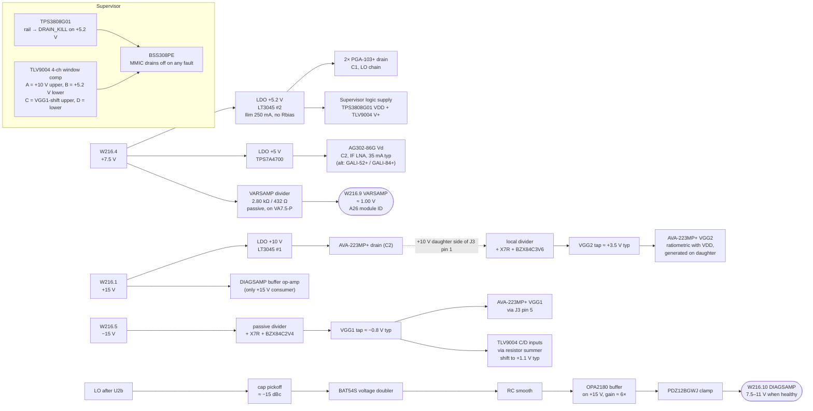

Two independent mechanisms converge on the A26 fault indication:

- **Supervisor** (TPS3808 + TLV9004 + BSS308PE) enforces "drain off on
  any rail fault" at µs speed, monitoring three nets through window
  comparators and cutting DRAIN_ENABLE to protect the GaAs pHEMTs
  against rail‑sag damage. **All supervisor logic runs off the +5.2 V
  rail**, not +15 V — TLV9004 (1.8–5.5 V) and TPS3808G01 (1.8–6.5 V)
  are both low‑voltage CMOS parts and would die on +15 V. Only the
  DIAGSAMP BUF op‑amp lives on the +15 V rail. The four TLV9004
  channels map to:
  - **A**: +10 V upper trip (AVA‑223MP+ VDD rail, scaled ÷ 2.2 to sit
    below V+).
  - **B**: +5.2 V lower trip (PGA‑103+ / LO rail; the same rail powers
    the supervisor itself — a "brown‑out" side‑effect means the chip
    latches DRAIN_KILL low as its own supply collapses, which is the
    safe direction).
  - **C / D**: VGG1 window, sensed via a two‑resistor input summer
    that shifts VGG1 ≈ −0.8 V into V_sum ≈ +1.1 V using the +5.2 V
    rail as reference (see WIN_REF below for R values and V_sum
    worked numbers). Catches both open‑resistor failures in the
    passive divider (R1 open → V_GG1 ≈ 0 V → V_sum ≈ 1.5 V → C trips;
    R_bleed open → V_GG1 → −2.4 V clamp → V_sum ≈ 0.3 V → D trips)
    and A26 −15 V rail sag.
  VGG2 is ratiometric with VDD (daughter‑side divider from the +10 V
  drain pin) so its failure set is a strict subset of the VDD set,
  already covered by channel A. One **AVA‑223MP+** is ~$85; the
  supervisor chipset adds <$4 and guards against the failure modes that
  kill this class of part. Gate‑before‑drain sequencing is satisfied by
  construction: V_GG1 is always‑on off the −15 V rail via a passive
  divider (no enable logic), V_GG2 is ratiometric with V_DD, and A26
  supply sequencing brings −15 V up before +10 V — to be verified at
  Build 2.
- **DIAGSAMP RF detector** reports LO / sampling‑pulse health to A26 as an
  analog 7.5–11 V signal — matching the R&S interface / fault semantics (A26 §7.1.5 calls
  this the *"Diagnose‑Gleichrichter des Sampling‑Moduls"*).

The two are coupled only indirectly: if the supervisor kills the MMIC drains,
the LO dies, the RF detector drops out of its 7.5–11 V window, and A26 sees
a fault through the normal telemetry path. The supervisor does **not** drive
DIAGSAMP directly (earlier drafts proposed this — see Revision history /
Alternatives considered).

### Rail‑health LED bank (visual indicators)

Six 0603 LEDs, one per rail, placed at the module edge near the harness
connector for at‑a‑glance power‑up confirmation and kill‑event feedback.
Always‑populated (not a DNP bring‑up kit — these stay on the board through
production). On the three killable rails (+10 V, +5.2 V, +5 V) the LED
doubles as a kill indicator: dark = rail absent or supervisor‑killed.

| Rail | V_nom | Source | Killable | R_LED (I ≈ 2 mA, V_f ≈ 2 V) |
|---|---|---|---|---|
| +15 V  | +15.0 V | W216.1 direct               | no  | 6.8 kΩ 0603 1 % (stock) |
| +10 V  | +10.0 V | On‑module LT3045 #1         | YES | 4.3 kΩ 0603 1 % (stock) |
| +7.5 V | + 7.5 V | W216.4 VA7.5‑P direct       | no  | 2.7 kΩ 0603 1 % (stock) |
| +5.2 V | + 5.2 V | On‑module LT3045 #2         | YES | 1.6 kΩ 0603 1 % (stock) |
| +5.0 V | + 5.0 V | On‑module ADM7154 / TPS7A4700 | YES | 1.5 kΩ 0603 1 % (stock) |
| −15 V  | −15.0 V | W216.5 direct               | no  | 6.8 kΩ 0603 1 % (stock) |

−15 V topology: LED cathode → −15 V, anode → ballast R → GND (reversed
vs positive rails). LED part options from stock (0603 body): red LSQ971,
yellow LYQ976, green Orient ORH‑G36G, blue ORH‑B96G, white ORH‑W96G — any
colour acceptable, pure visual cue. Per‑rail colour assignment left to
user preference at assembly time.

Area / cost budget: 6× (LED + R_LED) = 12 pads on the main board near the
connector edge; total current contribution ~12 mA summed across rails, all
drawn from stock. No external‑buy contribution.

### DIAGSAMP generator (analog RF detector)

The R&S service manual specifies DIAGSAMP at test point 1910 as the output of
a **diagnostic rectifier** on the sampling‑pulse generation (A26 §7.1.5:
*"über den Multiplexer [kann] der Diagnose‑Gleichrichter des Sampling‑Moduls
angewählt werden, um festzustellen, ob der Sampling‑Puls ordnungsgemäß
erzeugt wird"* — *"via the multiplexer the diagnostic rectifier of the
sampling module can be selected to determine whether the sampling pulse is
generated correctly"*). A26 reads it through multiplexer D62‑A at MUX address
0b010 with MUXEN1 = 1. 7.5…11 V means the LO / sampling‑pulse chain is
healthy; anything outside this window is reported as a module fault.

The manual closes the external requirement and the fault semantics, but not
the exact original internal witness node. Recent bench / photo work suggests
the legacy module may route this function internally via the undocumented X72
interconnect. The redesign therefore targets functional equivalence at
W216.10, not a claim that the original rectifier sampled exactly the same
internal point.

Topology — capacitive pickoff on the LO line after U2b (before Pad2), Schottky
voltage doubler, RC smoothing, and a buffered gain stage on the +15 V rail:

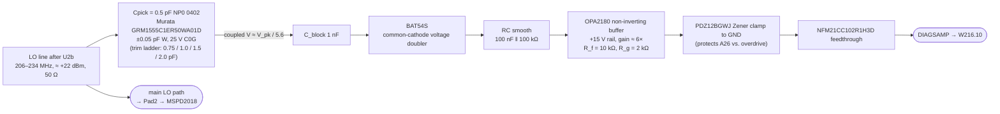

**Level budget at nominal LO (+19 dBm into MSPD after Pad2, +22 dBm at U2b output before Pad2):**

| Condition at U2b output | V_pk on LO (50 Ω) | V_pk at doubler input | V_DC out of doubler | V_out after ×6 gain | DIAGSAMP |
|---|---|---|---|---|---|
| LO failing (+16 dBm, U2b dropping out of sat) | 2.00 V | 0.36 V | 0.12 V (≈ 2×V_f, weak conduction) | ~0.7 V | < 7.5 V → fault |
| LO low (+18 dBm, partial LO-chain loss) | 2.52 V | 0.45 V | 0.30 V | 1.8 V | < 7.5 V → fault |
| **LO nominal (+22 dBm)** | 3.98 V | 0.71 V | 0.82 V | 4.9 V | 4.9 V on the baseline 6× stage — below window, lifted into 7.5–11 V at Build 2 by trimming Cpick up and/or gain to 8–10× |
| LO high-end of MSPD spec (+24 dBm, MSPD PREF ≈ +21 dBm) | 5.02 V | 0.90 V | 1.20 V | 7.2 V | healthy (lower edge) at baseline gain |
| LO near MSPD upper spec (+26 dBm, PREF ≈ +23 dBm) | 6.32 V | 1.13 V | 1.66 V | 10.0 V | healthy (mid-window) |

The pickoff cap value (`Cpick`) and the op-amp gain (`R_f / R_g`) are trimmed
at Build 2 bring‑up to land the nominal LO drive inside the 7.5–11 V window
across the 206…234 MHz LO frequency sweep. Expected trim: **Cpick ≈ 1–2 pF**
(tighter coupling than the shown 0.5 pF baseline) and/or **gain 8–10×**, once
the actual coupled level is measured on the prototype. The BAT54S provides
low Vf (~0.25 V at 1 mA) in an 0603 package; the OPA2180 is a zero‑drift
precision op‑amp (Vos ≤ 25 µV, 0.15 µV/°C) with rail‑to‑rail output to
within 15 mV of each supply, covering 0–12 V on the +15 V rail without
saturation. Zero‑drift is required so post‑gain output drift across the
module's 0…+60 °C envelope stays below A26 ADC resolution. The second
amplifier in the SOIC‑8 dual is a DNP unity follower on the Cpick pickoff
tap for Build 2 diagnostics.

**Failure mode coverage:**

| Fault | Mechanism | DIAGSAMP response |
|---|---|---|
| +7.5 V rail sags | LO chain LDO drops out → PGA‑103+ stages die | detector input → 0, output < 7.5 V → A26 fault |
| Supervisor trips (any rail) | BSS308PE kills MMIC drains | LO dies, detector → 0 |
| Individual PGA‑103+ MMIC damage | Drain current abnormal, gain drops | coupled level falls, output < 7.5 V |
| LO frequency off (A7 fault) | Level may stay in range, freq wrong | DIAGSAMP may stay in window — A26's YIG‑PLL lock detection catches this, not DIAGSAMP (consistent with the original fault partition) |
| Detector diode open | — | DIAGSAMP stuck at 0 V (fault) |
| Detector diode shorted | doubler output → V_pk of LO directly | DIAGSAMP may saturate high → Zener clamps at 12 V → A26 reads 12 V (outside 7.5–11 V window on the high side, fault) |

### VARSAMP generator

VARSAMP (W216.9) identifies the Sampling Module to A26 in a 0.9…1.1 V window.
Per A26 §7.1.5, each microwave module contains a **passive voltage divider
tied to its supply voltages**. The modernized design reproduces this by
dividing directly from the W216.4 +7.5 V (VA7.5‑P) rail — no internal LDO
between A26 and the divider, matching the original topology and eliminating
any dependence on internal regulators coming up at the right time:

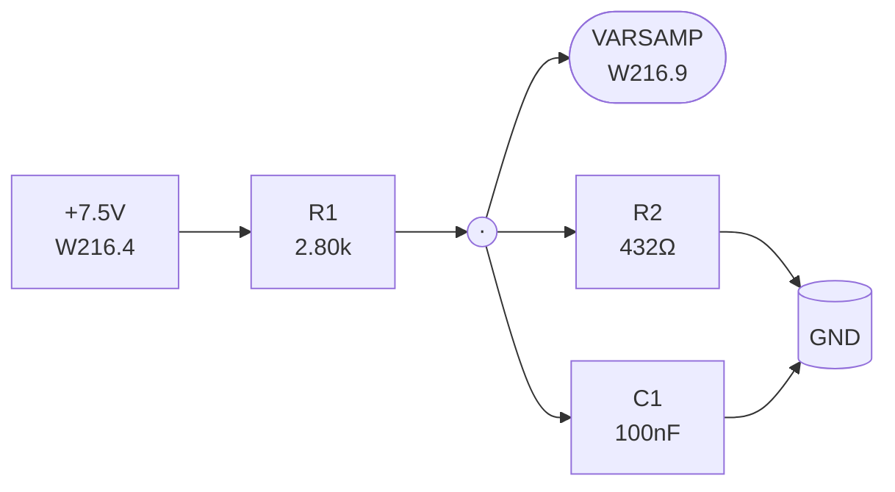

- Both resistors from precision kit stock, **0.1 % / 10 ppm/°C thin‑film** —
  TCR‑matched pair holds V_sense within ±0.3 mV across −40…+85 °C.
- Nominal ratio R2 / (R1 + R2) = 432 / 3232 = 0.1337 →
  VARSAMP = 7.5 × 0.1337 = **1.003 V**, centred in the 0.9…1.1 V window.
- Worst‑case: VA7.5‑P per W216 spec is +7.25…+7.75 V (±3.3 %), resistors
  ±0.1 %; bounding gives VARSAMP = **0.965…1.041 V**, inside the 0.9…1.1 V
  A21 spec and well inside the 0.5…1.5 V A26 acceptance window.
- Divider current ≈ 7.5 V / 7.49 kΩ ≈ 1 mA, permanent draw off VA7.5‑P,
  negligible vs the LO chain's ~194 mA on the same rail.
- C1 shunts the VARSAMP tap to GND, low‑passing any residual noise on
  VA7.5‑P before it reaches the A26 harness. Source impedance at the tap
  is R1 ‖ R2 ≈ 867 Ω, giving f₋₃dB ≈ 1 / (2π · 867 Ω · 100 nF) ≈ 1.8 kHz.
  Well below A26's mux‑ADC sample rate and more than enough to remove
  any audio‑band noise coupled onto the rail. A26's input is high‑Z
  (ADC mux input), so no active buffer is needed.

The A21 manual spec (0.9…1.1 V) is the *A21‑side* identification value; the
A26 ID‑window table (A26 §7.1.8.5) accepts **0.5…1.5 V** as "Sampling Module
installed" (−0.25…+0.25 V is read as "no module"). Targeting mid‑window
(1.00 V) gives ±0.5 V margin to both A26 acceptance edges, which is larger
than any tolerance source in the divider.

## Drive‑level budget (end to end)

| Node | Level | Source |
|---|---|---|
| X50 in | +5 dBm @ 110 MHz | A7 |
| After input pad (Pad1) | +2 dBm | 0805 T‑pad, 3 dB |
| After doubler | −10 dBm @ 220 MHz | JMS‑1H+ CL 12 dB |
| After BPF | −12 dBm | BFCN‑212+ |
| After U2a (PGA‑103+ #1, 22 dB gain) | +10 dBm | linear, small‑signal |
| After inter‑stage pad (Pad_IS) | +7 dBm | 0805 T‑pad, 3 dB, VSWR stabilizer |
| After U2b (PGA‑103+ #2) | +22 dBm | ~7 dB into compression → flat P1dB +22.5 dBm |
| After output pad (Pad2) | **+19 dBm into MSPD LO** (at J1' bullet) | centred in +17…+23 dBm |
| X211 in | +3 dBm @ f_RF | A20 |
| After PIN limiter | +2 dBm | MADL‑011022 |
| After AVA‑223MP+ (14 dB gain) | +16 dBm | |
| After 13 dB pad | **+3 dBm into MSPD RF** | ≤ +13 dBm max |
| MSPD IF | ≈ −19 dBm | CL ≈ 22 dB worst case @ 20 GHz band edge (datasheet typ ~18 dB mid-band; verify at Phase B per Open Item 3) |
| After LPF + notch | ≈ −19.7 dBm | LFCN‑105+ IL ≈ 0.5 dB + 2-stage notch passband ≈ 0.2 dB |
| After IF LNA (AG302‑86G, +15.6 dB) | **−4.1 dBm at X75 (worst case)** | mid‑band (CL ≈ 18 dB): **−0.1 dBm**; X75 lands inside A10's **0 ± 5 dBm** acceptance spec across the full MSPD CL spread with no post‑LNA pad needed (AG302‑86G native 15.6 dB vs 20 dB GALI‑52+ that required a 4 dB trim) |
| Reverse path at X211 | ≈ −55 dBc | 43 dB rev iso + 13 dB pad |

## Suggested BOM

Prices are single‑unit distribution quotes gathered during design work (April 2026).
Expect small variation between Mouser, DigiKey, and Mini‑Circuits direct.
The build scope is one working unit, so every cost line below is a single‑piece
quote; bulk / reel / volume tiers are not tracked.

**Stock legend** (applied in the Part column of the tables below):
`(in stock)` — part is on hand from lab inventory as of 2026‑04; cost shown
is the reorder price for rebuild planning. `(in stock, substitute for X)` —
on‑hand part replaces the nominal BOM part X; any footprint / pinout delta
is noted in the Role / Description cell.

### Sampling Phase Detector (replaces the milled microwave kernel)

| Ref | Part | Description | Cost | Source |
|---|---|---|---|---|
| U3 | **MACOM MSPD2018‑E50** *(external buy)* | Integrated SPD, 2–22 GHz, fREF ≥ 100 MHz, PREF +17…+23 dBm | ~$95 | [MACOM](https://www.macom.com/products/product-detail/MSPD2018-E50) · [Mouser](https://www.mouser.com/c/?q=MSPD2018-E50) · [DigiKey](https://www.digikey.com/en/products/result?keywords=MSPD2018-E50) |

### LO chain (103–117 MHz in → 206–234 MHz, +19 dBm out)

| Ref | Part | Description | Cost | Source |
|---|---|---|---|---|
| Pad1 | 3× 0805 **thin‑film** 1 %, TCR ≤ 100 ppm/°C (R_ser 8.66 Ω ×2, R_shunt 143 Ω) | Discrete 3 dB T‑pad, input trim / doubler source match. Per‑element dissipation ≤ 0.8 mW at +5 dBm → ≥156× margin on 0805 125 mW thin‑film. Trim‑by‑swap on the bench with an iron; no Mini‑Circuits MOQ / distribution dependency. Body standardised on 0805 across Pad1 / Pad_IS / Pad2 for single‑SKU BOM (rationale in T‑pad resistor spec bullet below). | ~$0.08 | [DigiKey](https://www.digikey.com/en/products/result?keywords=TNPW08058R66FT) · [Mouser](https://www.mouser.com/c/?q=TNPW0805+8R66) |
| U1 | Mini‑Circuits **JMS‑1H+** *(external buy)* | SMT doubler, 5–125 MHz in | ~$5 | [Mini‑Circuits](https://www.minicircuits.com/WebStore/dashboard.html?model=JMS-1H%2B) |
| F1 | Mini‑Circuits **BFCN‑212+** *(external buy)* | SMT BPF, 200–235 MHz | ~$6 | [Mini‑Circuits](https://www.minicircuits.com/WebStore/dashboard.html?model=BFCN-212%2B) |
| U2a | Mini‑Circuits **PGA‑103+** *(in stock)* | E‑pHEMT MMIC, 50 MHz–4 GHz, 22 dB gain, +22.5 dBm P1dB, SOT‑89 — first stage, linear | stock | [Mini‑Circuits](https://www.minicircuits.com/WebStore/dashboard.html?model=PGA-103%2B) · [Mouser](https://www.mouser.com/c/?q=PGA-103%2B) · [DigiKey](https://www.digikey.com/en/products/result?keywords=PGA-103%2B) |
| Pad_IS | 3× 0805 **thin‑film** 1 %, TCR ≤ 100 ppm/°C (R_ser 8.66 Ω ×2, R_shunt 143 Ω) | Discrete 3 dB T‑pad, U2a→U2b VSWR stabilizer. Input ≈ +10 dBm → worst element (shunt 143 Ω) dissipates 2.4 mW → ≥52× margin on 0805 125 mW thin‑film. Same product line and body size as Pad1 (see T‑pad resistor spec bullet). | ~$0.08 | (as Pad1) |
| U2b | Mini‑Circuits **PGA‑103+** *(in stock)* | Same part as U2a, driven ~7 dB into compression for output‑level flatness | stock | (as U2a) |
| RFC1, RFC2 | **Primary:** TDK **ADL2012‑R10M‑T01** (stock, 0805 drum‑core wirewound ferrite, purpose‑built for MMIC bias decoupling) — 100 nH ±20 %, Idc 500 mA, DCR ~100 mΩ typ, SRF ~1 GHz, Q ≥ 30. **Alt 1 (minimum footprint):** Coilcraft **0402HPH‑R10XJLW** (0402 ceramic wirewound, ±5 %, DCR 1.2 Ω max, Irms 310 mA, SRF 1.6 GHz). **Alt 2 (stock):** Johanson **LRW0805WKR10GG001E** (L805W kit, 0805 ceramic wirewound, ±10 %, DCR 0.43 Ω, Irms 500 mA, SRF 1.2 GHz, Q 57 @ 250 MHz) | 100 nH RF choke; \|Z\| ≈ 147 Ω at 234 MHz (≫ 50 Ω) — drain‑bias feed, one per PGA‑103+ stage. TDK ferrite‑core chosen as primary because its rising loss tangent above ~500 MHz actively damps bias‑loop parasitic resonances, complementing the AN60‑064 LF‑stab network at VHF. Q is not critical in this slot (no tank), so Q ≥ 30 is acceptable. Vd margin improves substantially vs Coilcraft spec: DCR 100 mΩ × 120 mA = 12 mV drop → Vd ≈ +5.19 V worst case (+130 mV headroom vs Coilcraft fallback). Coilcraft row preserved as minimum‑footprint fallback if the 0805 pad becomes a layout blocker. | stock (TDK / Johanson) / ~$0.40 ea (Coilcraft) | [TDK ADL2012](https://product.tdk.com/en/search/inductor/inductor/smd/info?part_no=ADL2012-R10M-T01) · [DigiKey 0402HPH](https://www.digikey.com/en/products/result?keywords=0402HPH-R10XJLW) · [JLCPCB LRW0805WKR10](https://jlcpcb.com/partdetail/18561530-LRW0805WKR10GG001E/C17432340) |
| FB_PGA1, FB_PGA2 | TDK **MPZ1608S221A** (stock, 0603 power bead kit) — 220 Ω ±25 % @ 100 MHz, Irms 2 A, DCR ~80 mΩ typ | Lossy "power bead" between the shared +5.2 V LT3045 rail and each PGA‑103+ bias ladder head; inserts immediately upstream of the 10 µF bulk cap (see MMIC bias ladder section). Isolates the two LO stages from each other across the shared rail (without it, 234 MHz and harmonic content kicked back by U2b rides the bulk‑cap node into U2a) and keeps the LT3045 error loop out of the bias‑loop resonance path. MPZ series is deliberately lossy / low‑Q so the bead + ladder caps do not form an LC gain peak. Vd drop 80 mΩ × 120 mA = 10 mV worst case → Vd ≈ +5.17 V at the ladder head, inside the PGA‑103+ DS 5.0 V typ envelope. 0603 body (vs 0805 MPZ2012 on the AVA / AG302 rails) chosen to save area in the dense LO compartment. | stock (kit) | [TDK MPZ1608S221A](https://product.tdk.com/en/search/emc/emc/bead/info?part_no=MPZ1608S221A) |
| L_stab1, L_stab2 | Coilcraft **0603HP** series 620 nH (or Murata LQW18A) *(external buy)* | LF stabilization inductor per AN60‑064 — series with R_stab from each PGA‑103+ RF input to GND, one per stage | ~$0.50 ea | [Coilcraft 0603HP](https://www.coilcraft.com/en-us/products/rf/ceramic-core-inductors/0603hp/) |
| R_stab1, R_stab2 | **Yageo RC0603FR‑07150RL** *(in stock, FR‑07 series)* — 150 Ω 0603 thick‑film, ±1 %, 100 mW, 100 ppm/°C | LF stabilization damping resistor, series with L_stab from each PGA‑103+ RF input to GND, one per stage. Dissipation << 1 mW (sits behind L_stab 620 nH at the PGA RF input), so TCR and power rating are non‑binding; commodity 0603 1 % thick‑film from any vendor (Panasonic ERJ‑3EKF1500V, Vishay CRCW0603150RFKEA, etc.) is interchangeable if Yageo stock runs out. | stock (Yageo reel) | [DigiKey RC0603FR‑07150RL](https://www.digikey.com/en/products/result?keywords=RC0603FR-07150RL) · [Mouser](https://www.mouser.com/c/?q=RC0603FR-07150RL) |
| Pad2 | 3× 0805 **thin‑film** 1 %, TCR ≤ 100 ppm/°C (R_ser 8.66 Ω ×2, R_shunt 143 Ω) | Discrete 3 dB T‑pad, output trim into MSPD LO. +22 dBm / 158 mW at U2b output → worst element (shunt 143 Ω) dissipates 38 mW → 3.3× margin on 0805 125 mW thin‑film. Pad2 is the dissipation driver that forces 0805 across the whole LO T‑pad family (0603 at 100 mW lands at 2.6× here and fails the 3× derate rule). See T‑pad resistor spec bullet for vendor product lines. | ~$0.08 | [DigiKey](https://www.digikey.com/en/products/result?keywords=TNPW08058R66FT) · [Mouser](https://www.mouser.com/c/?q=TNPW0805+8R66) |

#### LO chain schematic (Build 2 — 2× PGA‑103+ cascade, direct +5.2 V bias)

Signal path (SMT on the FR‑4 main board, inside Compartment 1). Every inter‑block
node carries a 1 nF 0402 NP0 DC block `[Cdc]` to isolate the DC bias of each
PGA‑103+ stage from neighbouring filters / pads / connectors:

```mermaid
flowchart LR
    X50(["X50<br/>103–117 MHz<br/>+5 dBm"])
    Pad1["Pad1<br/>−3 dB T-pad"]
    U1["U1 doubler<br/>JMS-1H+<br/>−12 dB, +2 → −10 dBm<br/>f → 2f"]
    F1["F1 BPF 220 MHz<br/>BFCN-212+"]
    U2a["U2a PGA-103+<br/>stage 1, +22 dB<br/>−12 → +10 dBm"]
    PadIS["Pad_IS<br/>−3 dB T-pad<br/>+10 → +7 dBm"]
    U2b["U2b PGA-103+<br/>stage 2 saturated<br/>+7 → +22 dBm"]
    Pad2["Pad2<br/>−3 dB T-pad<br/>+22 → +19 dBm"]
    J1(["J1'<br/>SMP bullet → daughter<br/>206–234 MHz<br/>+19 dBm LO into MSPD"])

    X50 -- "Cdc<br/>103–117 MHz" --> Pad1
    Pad1 -- "Cdc<br/>103–117 MHz" --> U1
    U1 -- "Cdc<br/>206–234 MHz" --> F1
    F1 -- "Cdc<br/>206–234 MHz" --> U2a
    U2a -- "Cdc<br/>206–234 MHz" --> PadIS
    PadIS -- "Cdc<br/>206–234 MHz" --> U2b
    U2b -- "Cdc<br/>206–234 MHz" --> Pad2
    Pad2 -- "Cdc<br/>206–234 MHz" --> J1
```

Bias injection at each PGA‑103+ stage (Vd fed directly from LT3045 #2 at +5.2 V — no Rbias ballast):

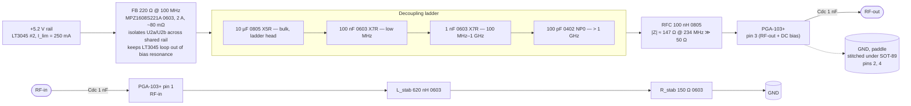

Ladder is **pin‑outward**: smallest cap (100 pF NP0) closest to P3,
bulk (10 µF X5R) farthest — each stage handles one decade of the
decoupling spectrum from > 1 GHz down to low‑MHz bulk.

- **Vd ≈ +5.18 V** at the pin typ with the as‑built **TDK ADL2012‑R10** RFC and MPZ1608S221A bead (Vrail 5.2 V − 8 mV FB − 10 mV RFC; DCR ~80 mΩ + ~100 mΩ × 97 mA). Worst case Vd ≈ +5.18 V at Id = 120 mA (FB 80 mΩ × 120 mA = 10 mV + RFC 100 mΩ × 120 mA = 12 mV, total 22 mV drop). **Fallback envelope with Coilcraft 0402HPH alt** (RFC only, bead unchanged): Vd ≈ +5.07 V typ / +5.05 V worst (1.2 Ω × 97–120 mA = 117–144 mV RFC drop plus 8–10 mV FB). Both cases sit inside PGA‑103+ DS nominal 5.0 V typ with room against abs max 6.0 V.
- **Id ≈ 97 mA typ / 120 mA max** per stage; total LO‑chain rail draw ≈ 194 mA typ, 240 mA worst‑case — inside LT3045's 500 mA capability, the 250 mA programmed limit, and the RFC's Irms rating per stage (TDK primary: 500 mA, 4.2× margin; Coilcraft fallback: 310 mA, 2.6× margin).
- **Thermal**: ~0.5 W dissipation per MMIC stays in Compartment 1 (unavoidable — it's the MMIC itself). The ~1.3 W that *would* have been burned in Rbias ballast resistors is relocated to the LT3045 on the main board outside the sealed can (LT3045 input from W216.4 +7.5 V rail → 2.3 V × 194 mA ≈ 0.45 W dropout at the regulator, with good copper pour and airflow).
- **LF stabilization network** (per Mini‑Circuits AN60‑064 / TB‑761‑103+): 620 nH + 150 Ω series, shunted from each PGA‑103+ RF input to GND. Impedance profile (series RL, `|Z| = √(R² + (ωL)²)`):
  - **DC – ~10 MHz**: |Z| ≈ R = 150 Ω (resistor dominates — `ωL ≤ 0.3 R`). Provides resistive damping exactly where the PGA‑103+ is otherwise prone to LF oscillation (per TB‑761‑103+ the device's stability factor k drops below 1 between roughly 1 and 100 MHz with no LF load).
  - **R = ωL corner** at `f_c = R / (2π L) ≈ 38 MHz`: |Z| ≈ √2·R ≈ 212 Ω. Puts the transition from "resistive damping" to "RF‑transparent" two octaves below the 206 MHz LO passband edge.
  - **10–100 MHz** (the PGA‑103+ LF instability band): |Z| rises smoothly from ~155 Ω at 10 MHz through ~246 Ω at 50 MHz to ~400 Ω at 100 MHz. Shunt loading stays low enough that the combined port impedance keeps |S₁₁·S₂₂| < 0.9 and `k > 1` across the full LF band per AN60‑064 Fig. 4.
  - **206–234 MHz passband**: |Z| ≥ 815 Ω → passband loss ≤ 0.3 dB (ratio of shunt |Z| to 50 Ω source).
  Component choice justification: 620 nH is the smallest value that keeps |Z| ≥ 800 Ω across the passband; 150 Ω is chosen so the LF plateau is `≥ 3×` the PGA's ~50 Ω input resistance, giving enough shunt loss to kill the instability without dominating passband return loss. Lower L would move `f_c` into the passband (eats gain); higher L would leave the 30–100 MHz gain peak undamped.
- **Inter‑stage pad** (Pad_IS, discrete 0805 3 dB T‑pad) stabilizes the U2a→U2b interface VSWR and drops the inter‑stage level by 3 dB so U2b enters compression predictably: +7 dBm drive into +22.5 dBm P1dB = ~7 dB overdrive, i.e. the saturated‑output regime where Pout is decoupled from input‑level variation (this is what delivers the ±0.5 dB flatness target across 206–234 MHz and across AGC state on X50).
- **Output pad** (Pad2, discrete 0805 3 dB T‑pad) trims the cascade from ~+22 dBm to the +19 dBm MSPD target and absorbs any residual mismatch at the J1' SMP bullet transition.
- **T‑pad resistor spec** (applies to Pad1, Pad_IS, Pad2, and any IF‑chain discrete T‑pad — GALI‑52+ adapter post‑LNA pad, optional notch→AG302 IF trim footprint). All LO and IF T‑pad positions share one 0805 thin‑film footprint for single‑SKU BOM uniformity; 0805 is forced by Pad2's 38 mW worst‑element dissipation (0603 at 100 mW fails the 3× derate rule there) and carried across the lower‑power positions to collapse the resistor SKU count to two (8.66 Ω and 143 Ω, both 0805):
  - **Topology** — 50 Ω symmetric T, R_ser = **8.66 Ω** (×2, E96, 1.3 % off ideal 8.55 Ω), R_shunt = **143 Ω** (E96, 0.8 % off ideal 141.9 Ω). Ideal attenuation 3.01 dB with perfect R; 1 % resistor tolerance translates to ≤ 0.1 dB attenuation error and ≥ 23 dB return loss at 234 MHz on an 0805 body (~0.6 nH end‑cap inductance vs ~0.4 nH on 0603 trades ~3 dB of return‑loss headroom; still well above the 20 dB target, and the PGA‑103+ port VSWR dominates the chain budget regardless).
  - **Technology — thin‑film mandatory, thick‑film not acceptable.** Three reasons: (a) TCR ≤ 50 ppm/°C holds attenuation flat over −40…+85 °C (thick‑film 100–250 ppm/°C drifts > 0.05 dB over the same span); (b) parasitic series inductance < 0.5 nH per resistor (thick‑film laser‑trimmed serpentines run 1–2 nH, enough to visibly tilt return loss near 234 MHz); (c) low‑ohm thick‑film values (< 10 Ω) are produced with metal‑foil jumpers that have poor HF behavior — the 8.66 Ω series arms are particularly exposed.
  - **Tolerance** — 1 % on all three elements. 0.1 % tightens attenuation accuracy to ≤ 0.02 dB but is not required for this LO chain (doubler + saturated PGA‑103+ dominate the level‑flatness budget).
  - **TCR** — ≤ 100 ppm/°C required, ≤ 50 ppm/°C preferred. What matters for attenuation drift is the **TCR match** between series and shunt elements, so pick all three resistors from the same manufacturer / series / tolerance class.
  - **Power rating** — 0805 ≥ 125 mW across all positions. Worst‑element dissipation and margin by pad: Pad1 0.8 mW (156×), Pad_IS 2.4 mW (52×), Pad2 38 mW (3.3×). Pad2 is the driver — 0603 at 100 mW lands at 2.6× here and fails the 3× rule — so 0805 is used on Pad1 and Pad_IS as well to collapse the resistor SKU set and simplify the pick‑and‑place feeder list.
  - **Recommended product lines** (any one, all stocked at Mouser / DigiKey in the 0805 body size and in both 8.66 Ω and 143 Ω values):

    | Product line | Tol. | TCR | Notes |
    |---|---|---|---|
    | **Vishay TNPW0805** | 0.1–1 % | 25 ppm/°C | AEC‑Q200, best low‑ohm coverage including 8.66 Ω. **Baseline** — MPNs shown in the BOM rows are TNPW0805 8R66 and 143R. |
    | **Panasonic ERA‑6A** | 0.1–0.5 % | 25 ppm/°C | AEC‑Q200, widest distributor stock. Use ERJ‑U if a 1 % / thin‑film / low‑cost variant is preferred over the tighter ERA‑A grade. |
    | **Yageo RT0805** | 0.1–1 % | 50 ppm/°C | AEC‑Q200, cheapest of the three (~$0.02 / pc). Pick this if building many modules. |
    | **Susumu RG2012** *(alt)* | 0.1 % | 10 ppm/°C | Characterized to 2 GHz; premium option if attenuation‑over‑temp turns out to be the constraint on Phase B measurements. |

    Bench trim kit: stock a handful of 6.98 Ω / 7.50 Ω / 8.06 Ω / 9.31 Ω / 10.0 Ω series values and 121 Ω / 133 Ω / 154 Ω / 165 Ω shunt values in the same 0805 product line to build 2 / 2.5 / 3.5 / 4 dB T‑pads for swap‑tuning any LO or IF T‑pad without a BOM revision.
- **Why no post‑U2b harmonic filter**: U2b in saturation produces 2f₀ at ~−20 dBc and 3f₀ at ~−25 dBc (PGA‑103+ typ under 7 dB overdrive). These are phase‑coherent with the fundamental and therefore add coherently to the SRD‑generated comb lines inside the MSPD at the same frequencies, which dominate (SRD 2nd‑comb line is typically only −6 to −10 dBc of fundamental). Total LO‑port power increase ≤ 0.1 dB — PREF stays well inside the +17…+23 dBm window — and no new IF spurs are created because the MSPD mixing is against the SRD comb, not against external LO harmonics. A filter here would add insertion loss and VSWR ripple for no measurable spur‑budget benefit. Verify at Build 2 with a spectrum sweep at the J1' bullet: 2f₀ ≤ −15 dBc and 3f₀ ≤ −20 dBc are acceptance thresholds.
- **DC blocks**: every `[Cdc]` is a 1 nF 0402 NP0 (**Murata GRM1555C1H102JA01D**, ±5 % J, 50 V, from stock); SRF ~1 GHz, |Z| < 1 Ω across 206–234 MHz. Present on both RF pins of each PGA‑103+ so the pin‑3 +5 V never reaches the next filter / pad / connector.
- **Ground return**: each of the 100 pF, 1 nF, and Cdc caps gets a dedicated via to the inner GND plane adjacent to the cap pad, not shared with the other ladder stages (shared return inductance collapses the decoupling at the pin).

### RF path (2–20 GHz buffer / reverse isolator)

| Ref | Part | Description | Cost | Source |
|---|---|---|---|---|
| L1 | **MACOM MADL‑011022** *(external buy)* | PIN limiter, 0.1–20 GHz, Pmax +30 dBm | ~$20 | [MACOM](https://www.macom.com/products/product-detail/MADL-011022) · [Mouser](https://www.mouser.com/c/?q=MADL-011022) |
| U4 | **Mini‑Circuits AVA‑223MP+** *(external buy)* | GaAs pHEMT MMIC, 0.1 MHz–22 GHz, 14 dB gain, +26 dBm P1dB, **43 dB reverse isolation**, 32‑QFN 5×5 mm | **~$90** | [Mini‑Circuits](https://www.minicircuits.com/WebStore/dashboard.html?model=AVA-223MP%2B) · [Mouser](https://www.mouser.com/c/?q=AVA-223MP%2B) · [DigiKey](https://www.digikey.com/en/products/result?keywords=AVA-223MP%2B) |
| Pad3A | Kyocera AVX **AT0603C09ECATB** *(external buy)* | 9 dB primary attenuator, 0603 AlN thin‑film pi, DC–20 GHz, 0.75 W (mainline Mouser / DigiKey C‑variant). Takes the bulk of the dissipation (≤ 90 mW at worst‑case AVA drive → 8.3× margin). See component‑size standardization table for the all‑Ohmite 2+4+7 cascade as a documented cost‑down alternative. | ~$15 | [Mouser](https://www.mouser.com/c/?q=AT0603C09ECATB) · [DigiKey](https://www.digikey.com/en/products/result?keywords=AT0603C09ECATB) |
| Pad3B | Ohmite **TFA16C04DBER** *(external buy; default value, TFA16C01/02/03/05 on shelf for trim)* | 4 dB trim chip in cascade with Pad3A, 0603 thin‑film, DC–20 GHz, 64 mW. Default 9+4 = 13 dB; swap with TFA16C01/02/03/05 for 10/11/12/14 dB total across the 10–14 dB trim window. Second‑slot dissipation ≤ 8 mW at nominal drive (≥8× margin). | ~$0.30 | [JLCPCB](https://jlcpcb.com/parts/componentSearch?searchTxt=TFA16C04DBER) · [Mouser](https://www.mouser.com/c/?q=TFA16C04DBER) |

**RF buffer footprint — AVA‑223MP+ only:** the board carries the 32‑QFN 5×5 mm footprint for U4. No fallback buffer MMIC is approved on this revision. The MACOM MAAM‑011289 was investigated as a cost‑down alternative and rejected — the part is specified 5–20 GHz only and the datasheet S21 curve rolls off to ≈ 5 dB at 2.5 GHz, missing the 2–5 GHz sub‑band gain requirement by ~8 dB (see *Alternatives considered*). No other 2–20 GHz MMIC with ≥ 40 dB reverse isolation at meaningfully lower cost than the AVA has been identified; AVA‑223MP+ stands as the sole approved buffer.

### IF path (10–80 MHz)

| Ref | Part | Description | Cost | Source |
|---|---|---|---|---|
| F2 | Mini‑Circuits **LFCN‑105+** *(external buy)* | SMT LPF, DC–105 MHz | ~$4 | [Mini‑Circuits](https://www.minicircuits.com/WebStore/dashboard.html?model=LFCN-105%2B) · [Mouser](https://www.mouser.com/c/?q=LFCN-105%2B) |
| — | Coilcraft **0402CS** + Murata GRM | Discrete LC notches at 103 / 206 MHz | <$2 total | [Coilcraft 0402CS](https://www.coilcraft.com/en-us/products/rf/ceramic-core-inductors/0402cs/) |
| U5 | **MACOM AG302‑86G** *(primary, pending batch screening — see `ag302_86g_screening_plan.md`)* | InGaP HBT MMIC amp, DC–6 GHz, **15.6 dB gain**, P1dB +13.5 dBm, NF 3.5 dB, 35 mA @ +5 V, **SOT‑86 ("Micro‑X") 4‑lead** package; self‑biased (Pin 3 = Vd + RFout), no gate rail | ~$3.50 (stock) | [MACOM](https://www.macom.com/products/product-detail/AG302-86G) · [Mouser](https://www.mouser.com/c/?q=AG302-86G) · [DigiKey](https://www.digikey.com/en/products/result?keywords=AG302-86G) |

**IF LNA footprint — primary choice AG302‑86G, fallback via adapter PCB:** the board carries a **single SOT‑86 footprint** for U5 — AG302‑86G primary. Post‑LNA trim pad (formerly Pad4 HAT‑4+) is removed from the signal path: AG302‑86G's native 15.6 dB gain already places X75 at −0.1 dBm mid‑band / −4.1 dBm worst case, both inside A10's 0 ± 5 dBm window, so no attenuator trim is needed in the nominal build. If batch screening on the 50 AG302‑86G units in stock shows a systemic device‑level failure (NF, P1dB, or S21 flatness outside the `ag302_86g_screening_plan.md` pass criteria), the documented fallback is a tiny adapter PCB (≤ 10×10 mm) that maps a GALI‑52+ or GALI‑84+ onto the SOT‑86 pad pattern — same +5 V rail, same TPS7A4700, and in the GALI‑52+ case a re‑introduced 4 dB **discrete 0805 T‑pad** after the LNA (per the T‑pad resistor spec under "LO chain rationale") to trim 20 dB → 16 dB chain gain. This keeps the A21 main‑board layout committed to one footprint (clean single‑component assembly), without losing the option to fall back to a documented, in‑stock GALI alternate.

### Bias, regulation, supervisor, telemetry

| Ref | Part | Role | Cost | Source |
|---|---|---|---|---|
| LDO1 | ADI **LT3045** *(external buy)* | +10 V low‑noise LDO for AVA‑223MP+ drain (C2) | ~$7 | [DigiKey](https://www.digikey.com/en/products/result?keywords=LT3045) · [Mouser](https://www.mouser.com/c/?q=LT3045) |
| LDO2 | ADI **LT3045** *(external buy)* | +5.2 V LDO for 2× PGA‑103+ drain (C1 LO chain), fed from W216.4 +7.5 V tap; I_lim programmed to 250 mA; direct bias (no Rbias ballast) | ~$7 | [DigiKey](https://www.digikey.com/en/products/result?keywords=LT3045) · [Mouser](https://www.mouser.com/c/?q=LT3045) |
| FB_LDO2 *(DNP footprint)* | TDK **MPZ2012S221A** 0805 (same part as AVA / AG302 beads — single BOM line) — 220 Ω @ 100 MHz, Irms 3 A, DCR 40 mΩ | **Optional pi‑filter bead** on the LDO2 input, between the NFE61PT102E1H9L C1 feedthrough (+7.5 V harness side) and the LT3045 #2 VIN pin. **Footprint only — DNP in baseline BOM**, shorted by a 0 Ω 0805 jumper. **Install trigger (Build 2):** with the LO chain bringing up, measure the LT3045 #2 output on a spectrum analyser through a DC block. If rail content at 234 MHz or its harmonics (468 / 702 MHz) exceeds **−70 dBc** relative to the +19 dBm LO drive at J1', swap the 0 Ω for the bead and re‑sweep. Rationale for DNP baseline: the NFE61PT feedthrough (≥ 20 dB at 200 MHz) plus LT3045 PSRR (≥ 60 dB below 1 MHz, ≥ 30 dB typ at 200 MHz) is expected to leave < −80 dBc in the first build; the bead is belt‑and‑suspenders insurance, not a known requirement. Vd budget if installed: FB drop 40 mΩ × 240 mA = 10 mV reduces LT3045 dropout headroom from 2.3 V to 2.29 V — still > 7× the 300 mV dropout spec. | stock (kit) / 0 Ω jumper baseline | [TDK MPZ2012S221A](https://product.tdk.com/en/search/emc/emc/bead/info?part_no=MPZ2012S221A) |
| LDO3 | TI **TPS7A4700** *(external buy)* | +5 V ultra‑low‑noise LDO for AG302‑86G IF LNA (C2); 35 mA typ draw (headroom for 65–80 mA fallback to GALI‑52+/84+ via adapter PCB without changing the LDO) | ~$8 | [DigiKey](https://www.digikey.com/en/products/result?keywords=TPS7A4700) · [Mouser](https://www.mouser.com/c/?q=TPS7A4700) |
| SUP | TI **TPS3808G01DBVR** *(external buy)* | Adjustable supervisor / reset (rail protection only; not telemetry) | ~$2 | [DigiKey](https://www.digikey.com/en/products/result?keywords=TPS3808G01DBVR) · [Mouser](https://www.mouser.com/c/?q=TPS3808G01DBVR) |
| WIN | TI **TLV9004IDR** *(external buy)* | Quad RRIO op‑amp on +5.2 V (1.8–5.5 V family, 60 µA/ch), SOIC‑14. All four channels feed the DRAIN_KILL wired‑OR bus. **A**: +10 V upper trip (VDD scaled ÷ 2.2). **B**: +5.2 V lower trip (rail ÷ 1.1). **C**: VGG1 upper trip (V_sum > +1.4 V, i.e. V_GG1 > ≈ −0.2 V — catches R1 open). **D**: VGG1 lower trip (V_sum < +0.5 V, i.e. V_GG1 < ≈ −2.2 V — catches R_bleed open / BZX84C2V4 clamp, −15 V rail sag). | ~$1.00 | [DigiKey](https://www.digikey.com/en/products/result?keywords=TLV9004IDR) · [Mouser](https://www.mouser.com/c/?q=TLV9004IDR) |
| WIN_REF | 7× 0.1 % thin‑film R (mixed 0603 / 0805, precision kit stock) + 2× **100 kΩ 0603 0.1 % external‑buy** + 1× 0603 X7R (100 nF) + 4× **0402 X7R (10 nF, Murata GCM155R71H103KA55D 50 V AEC‑Q, stock)** | **TLV9004 reference + VGG1‑summer network.** (a) Rail dividers, all 0.1 % / 10 ppm/°C thin‑film from precision kit stock (same‑series TCR match is what holds trip accuracy — the absolute ratio is flexible and trimmed against the threshold ladder at Build 2): **+10 V sense** = 3.3 kΩ 0603 + 2.8 kΩ 0603 → V_sense = 10 × 2.8/6.1 = 4.59 V (ratio ÷ 2.18); **+5.2 V sense** = 316 Ω 0805 + 3.16 kΩ 0805 → V_sense = 5.2 × 3.16/3.476 = 4.727 V (ratio exactly ÷ 1.1). 10 ppm/°C matched pairs hold both sense nodes within ±0.3 mV across −40…+85 °C, tightening supervisor trip accuracy to ≈ ±15 mV vs ~±150 mV for the original 1 % baseline. (b) Threshold reference ladder: 3‑tap divider from the +5.2 V rail generating V_UTP / V_LTP pairs around the four comparator trip points. Top tap committed as **160 Ω 0603 0.05 % / 10 ppm** (tightest tolerance in the precision kit — applied where trip drift matters most); remaining ladder resistors pulled from the same 0.1 % / 10 ppm kit, values finalised at Build 2 once V_GG1 tuning point is locked. (c) **VGG1 summer**: two **100 kΩ 0603 0.1 % / 25 ppm thin‑film, Vishay TNPW0603100KBEEA — external‑buy** (10× strip ~$3, single precision‑R line item for the module; kit does not stock 100 kΩ 0.1 %). Summer topology: both 100 kΩ resistors sum V_GG1 (nom −0.8 V) with a +3.0 V reference tap off the +5.2 V rail into the channel C/D non‑inverting inputs, giving V_sum = (V_GG1 + V_ref) / 2. Worked numbers: V_GG1 = −0.8 V → V_sum = +1.10 V (nom); V_GG1 = 0 V (R1 open) → V_sum = +1.50 V; V_GG1 = −2.4 V (clamp / R_bleed open) → V_sum = +0.30 V; all three stay ≥ 0 V, inside the TLV9004 V− = GND common‑mode rail. 100 kΩ is chosen (not ≤ 10 kΩ) to keep loading on the 950 Ω V_GG1 tap below 50 mV; τ_in ≈ 250 ns is well inside the ≤ 10 µs DRAIN_KILL budget. (d) Decoupling: 100 nF X7R at the TLV9004 V+ pin, 10 nF 0402 X7R on each of the four threshold nodes to reject µs‑scale chatter (0402 downsize from the default 0603 — low V_applied ≤ +5 V on the comparator input gives negligible DC‑bias loss on the 50 V AEC‑Q part, and 0402 shrinks the footprint on the dense WIN comparator side). | ~$0.60 (incl. 2× TNPW0603100K external‑buy) | [DigiKey TNPW0603100K](https://www.digikey.com/en/products/result?keywords=TNPW0603100KBEEA) · [Mouser](https://www.mouser.com/c/?q=TNPW0603100KBEEA) |
| SW | Infineon **BSS308PEH6327XTSA1** *(in stock, substitute for FDN302P)* | P‑MOSFET drain kill switch (high‑side, source on +10 V VDD). SOT‑23, −30 V, −2 A, R_DS(on) ≈ 170 mΩ @ V_GS = −10 V / ≈ 260 mΩ @ V_GS = −4.5 V, V_GS(th) max −1.1 V (logic‑level). Same SOT‑23 footprint and G/S/D pinout as the nominal FDN302P; better I_D and V_DS margin at ≈ same R_DS(on). | ~$0.40 | [DigiKey](https://www.digikey.com/en/products/result?keywords=BSS308PEH6327XTSA1) · [Mouser](https://www.mouser.com/c/?q=BSS308PEH6327XTSA1) |
| DET | onsemi **BAT54SLT1G** *(in stock)* | Dual Schottky, common‑cathode → voltage doubler at LO detector pickoff; Vf ≈ 0.25 V @ 1 mA, SOT‑23. (Generic "BAT54S" onsemi PN is obsolete per DigiKey; BAT54SLT1G is the active tape‑and‑reel SKU. Drop‑in equivalents: Diodes Inc. BAT54S‑7‑F, Nexperia BAT54S,215.) | ~$0.10 | [DigiKey](https://www.digikey.com/en/products/result?keywords=BAT54SLT1G) · [Mouser](https://www.mouser.com/c/?q=BAT54SLT1G) |
| BUF | TI **OPA2180IDR** *(in stock)* | Dual zero‑drift precision op‑amp, 4…36 V supply, SOIC‑8. Runs off +15 V to buffer DIAGSAMP detector and swing 0–12 V output; V_os ≤ 25 µV, drift 0.15 µV/°C holds DIAGSAMP level within A26‑ADC resolution across the 0–60 °C envelope after the ~6–10× gain trim. Second amplifier is a DNP input‑pickoff buffer for Build 2 diagnostics. | stock | [DigiKey](https://www.digikey.com/en/products/result?keywords=OPA2180IDR) · [Mouser](https://www.mouser.com/c/?q=OPA2180IDR) |
| CLP | Nexperia **PDZ12BGWJ** *(in stock, substitute for BZX84C12)* | 12 V ±5 % Zener clamp on DIAGSAMP output (protects A26 input against op‑amp rail‑slam); SOD‑123, 365 mW. Footprint change SOT‑23 → SOD‑123 vs the nominal BZX84C12; 2‑terminal, polarized. | ~$0.10 | [DigiKey](https://www.digikey.com/en/products/result?keywords=PDZ12BGWJ) · [Mouser](https://www.mouser.com/c/?q=PDZ12BGWJ) |
| DIV | 2× 0.1 % thin‑film from precision kit stock | VARSAMP divider, **R_top = 2.80 kΩ 0603 / R_bot = 432 Ω 0805, both 0.1 % / 10 ppm/°C** *(in stock precision kit)*, directly off W216.4 VA7.5‑P (no active buffer; A26 input is high‑Z). V_sense = 7.5 × 432/(2800 + 432) = **1.003 V** at V_rail = 7.50 V nom, vs the spec window 1.00 ± 0.05 V (3 mV inside centre, ≫ the ±0.2 % tolerance stack from the 0.1 % pair). TCR‑matched 10 ppm/°C pair holds V_sense within ±0.3 mV across −40…+85 °C. Divider current 2.3 mA on the +7.5 V rail; dissipation 15 mW on the 2.80 kΩ top (≫ 3× derate on 100 mW 0603). Replaces the earlier 6.49 kΩ + 1.00 kΩ 1 % pair — 10× tighter absolute accuracy, TCR‑matched vs the prior 1 % mixed pair, and the 6.49 kΩ external‑buy line is dropped. | stock | (precision kit, no new order) |
| GBIAS1 | 2× 0.1 % thin‑film from precision kit stock + 1× 0603 X7R + 1× onsemi **BZX84C2V4LT1G** | AVA‑223MP+ **VGG1** bias network (main‑board side, routed to daughter over J3 pin 5): passive divider off W216.5 −15 V with **R1 = 53.6 kΩ 0603 / R_bleed = 3.16 kΩ 0805, both 0.1 % / 10 ppm/°C** *(in stock precision kit)* — V_tap = −15 × 3.16/56.76 = **−0.835 V** starting point (datasheet V_GG1 typ ≈ −0.8 V; trim at Build 2 with a small parallel R across R_bleed to hit the screened‑device I_DD = 300 mA target). 10 ppm/°C TCR‑matched pair holds V_GG1 within ±0.5 mV across the operating envelope. 100 nF X7R decoupling cap, **2.4 V** Zener clamp backstop (sits inside the datasheet V_GG1 min of −2.0 V). No regulator. | ~$0.10 | [DigiKey](https://www.digikey.com/en/products/result?keywords=BZX84C2V4LT1G) · [Mouser](https://www.mouser.com/c/?q=BZX84C2V4LT1G) |
| GBIAS2 | 2× 0402 1 % R **external‑buy** (Vishay **CRCW04026K49FKED** + **CRCW04023K48FKED**, or any 0402 1 % thick‑film equivalent) + 1× 0402 X7R + 1× onsemi **BZX84C3V6LT1G** | AVA‑223MP+ **VGG2** bias network (**daughter‑side**, local to the AVA VGG2 pin, fed from the +10 V VDD pad on the daughter): passive divider **R_top = 6.49 kΩ 0402 / R_bot = 3.48 kΩ 0402, both 1 %** (nearest E96 to 6.5 k / 3.5 k; kit does not stock these specific values). V_tap = 10 × 3.48 / 9.97 = **+3.49 V** starting point (datasheet V_GG2 typ ≈ +3.5 V; final values trimmed at Build 2). Ratiometric with V_DD, so no independent‑rail failure mode — covered by the +10 V window via TLV9004 channel A. 100 nF X7R decoupling cap, **3.6 V** Zener clamp backstop (sits inside V_GG2 max of +3.75 V). Order 10× each on the same Mouser cart as the 100 kΩ WIN_REF summer pair (~$0.30 each in singles, ~$3 combined). | ~$0.20 | [DigiKey CRCW04026K49](https://www.digikey.com/en/products/result?keywords=CRCW04026K49FKED) · [DigiKey CRCW04023K48](https://www.digikey.com/en/products/result?keywords=CRCW04023K48FKED) · [DigiKey BZX84C3V6](https://www.digikey.com/en/products/result?keywords=BZX84C3V6LT1G) |

### Connectors, substrate, shielding

Five connector / material decisions land in this section:

- **X211 bench connector** — carries 2–20 GHz, locked to **3.5 mm
  female edge‑launch** (Southwest 292‑04A‑5 or Rosenberger 02K80‑40ML5,
  DC–33 GHz).
- **IF / reference bench connectors (X75 IF‑OUT 10–80 MHz,
  X50 FSTEP‑IN 103–117 MHz)** — stay SMB, matching the original
  R&S harness. SMB's 4 GHz rating leaves more than an order of
  magnitude of margin on both, and the harness mates directly; no
  bandwidth or cost reason to change. The original X21 chassis LO
  test point (206–234 MHz) is dropped entirely — the modernized
  module is "no factory cal required", and bring‑up / debug LO
  measurements use the J1' SMP board‑to‑board bullet‑pull inside
  the module instead (same information path, no extra chassis
  connector, no insertion loss on the main LO trace).
- **Substrate split** — Rogers RO4350B 0.51 mm 2‑layer for the ~25 × 40 mm
  RF core daughter (limiter → AVA‑223MP+ → pad → MSPD2018), FR‑4 4‑layer
  1.6 mm for the main board (LO chain, IF chain, LDOs, supervisor, all
  four bench connectors). Motivation is in "Board split rationale"
  below.
- **Board‑to‑board interconnect** — LO (206–234 MHz) and IF (10–16 MHz)
  cross between daughter and main on 2× **Amphenol SMP‑FS2A‑645**
  smooth‑bore bullets between SMP‑MSSB class PCB jacks on each board;
  **5–6 mm** standoff height; ±0.5 mm radial / ±0.25 mm axial
  self‑alignment; 20 GHz rated (bandwidth unused on these signals
  but the blind‑mate geometry is proven and the same jack family is
  used at 20 GHz on the daughter RF‑probe test point). Interconnect
  BOM ~$36 / module. MMCX was considered as a cheaper semi‑blind‑mate
  alternative and rejected — see *Alternatives considered*. DC / bias /
  telemetry crosses on a single **2×3 1.27 mm Samtec header pair**;
  mechanical fix is **4× M2.5 brass standoffs** sized to the SMP stack.
- **Shielding** — 2× Harwin S02 tin‑plate cans on the main board,
  laying out one or two RF compartments; trade‑off in "Compartment
  strategy" below.

| Ref | Part | Role | Cost | Source |
|---|---|---|---|---|
| X211 | **Southwest 292‑04A‑5** (or Rosenberger 02K80‑40ML5) *(external buy)* | 3.5 mm female edge‑launch, DC–33 GHz, mates with SMA | ~$18–25 | [DigiKey](https://www.digikey.com/en/products/result?keywords=292-04A-5) · [Mouser](https://www.mouser.com/c/?q=3.5mm+edge+launch) |
| X50, X75 | Amphenol RF **132136** *(external buy)* | SMB right‑angle PCB jack ×2, DC–4 GHz | ~$9 ea | [DigiKey](https://www.digikey.com/en/products/detail/amphenol-rf/132136/1477587) · [Mouser](https://www.mouser.com/c/?q=132136) |
| W216 | Würth **61201021621** *(in stock)* | **2×5** 2.54 mm shrouded box header (WR‑BHD), 10 contacts, through‑hole straight, gold‑plated, 3 A / 250 V | stock | [DigiKey](https://www.digikey.com/en/products/result?keywords=61201021621) · [Mouser](https://www.mouser.com/c/?q=61201021621) |
| Substrate (RF core daughter) | Rogers **RO4350B** 0.51 mm, 2‑layer, ENIG *(external buy — JLCPCB HF service, 5 pc)* | Low‑loss RF laminate carrying limiter + AVA‑223MP+ + pad + MSPD2018 (≈ 25 × 40 mm) | ~$47 (5 pc) | [Rogers RO4350B](https://www.rogerscorp.com/advanced-electronics-solutions/ro4000-series-laminates/ro4350b-laminates) |
| Substrate (main board) | **FR‑4 4‑layer**, 1.6 mm, ENIG *(external buy — JLCPCB standard, 5 pc)* | Carries LO chain, IF chain, LDOs, supervisor, connectors — RF core daughter mounts on top and plugs in via the SMP board‑to‑board bullets + pin header | ~$15–25 (5 pc) | JLCPCB / PCBWay standard |
| Board‑to‑board bullet | 2× **Amphenol RF SMP‑FS2A‑645** *(external buy)* | SMP plug‑to‑plug smooth‑bore bullet, 6.45 mm OAL, bullet rated DC–26.5 GHz; **as installed between two SMP‑MSSB jacks the hop is jack‑limited to DC–20 GHz** (see jack row below). Carries LO (206–234 MHz) and IF (10–16 MHz) between daughter and main. Smooth‑bore for easy rework; ±0.5 mm radial self‑alignment. | ~$6 ea | [DigiKey](https://www.digikey.com/en/products/result?keywords=SMP-FS2A-645) · [Mouser](https://www.mouser.com/c/?q=SMP-FS2A-645) |
| Board‑to‑board jacks | 2× **Amphenol RF SMP‑MSSB‑PCS17T** (SMT, brass, enhanced 20 GHz, T&R) on the **Rogers daughter** + 2× **Amphenol RF SMP‑MSSB‑PCT‑10** (through‑hole, brass, enhanced 20 GHz) on the **FR‑4 main** *(external buy)* | SMP smooth‑bore female PCB jack, 4 total (2 per board), **all rated DC–20 GHz** on Amphenol's enhanced‑geometry brass line. Termination split chosen per board: SMT on the thin Rogers daughter preserves the bottom GND pour inside the J1 / J2 / standoff cavity fence (no TH clearance holes); through‑hole on the FR‑4 main anchors the jack barrel into the 1.6 mm substrate for repeated bullet‑pull mate cycles during bring‑up and keeps the main‑board jacks mechanically indifferent to bench‑cable detent class (enables the Bucket G AliX‑gamble path). Do **not** substitute plain SMP‑MSSB‑PCS (brass SMT) or SMP‑MSSB‑PCT (brass TH) — both are non‑enhanced 18 GHz variants; the `‑17` / `‑10` suffix denotes the enhanced 20 GHz geometry. Mates with the FS2A‑645 bullet. | ~$6 ea (both variants) | [Amphenol PCS17T](https://www.amphenolrf.com/smp-mssb-pcs17t.html) · [Amphenol PCT‑10](https://www.amphenolrf.com/smp-mssb-pct-10.html) · [Mouser](https://www.mouser.com/c/?q=SMP-MSSB) |
| Board‑to‑board header | 1× 2×3 1.27 mm SMT pin header on daughter (Samtec **FTS‑103‑01‑L‑DV**) + 1× mating socket on main (Samtec **CLM‑103‑02‑L‑D**) *(external buy)* | DC / bias / telemetry (+10 V AVA drain, V_GG1 AVA (≈−0.8 V typ, passive divider off W216.5 −15 V), DRAIN_KILL, 2× GND, 1× reserved) — unchanged by the RF connector choice. V_GG2 (+3.5 V typ, gate 2) is generated on the daughter from the +10 V drain pad and does not cross J3. MSPD2018‑E50 is a passive hybrid and needs no daughter‑side bias rail. | ~$5 pair | [DigiKey](https://www.digikey.com/en/products/result?keywords=FTS-103-01-L-DV) · [Mouser](https://www.mouser.com/c/?q=FTS-103-01-L-DV) |
| Board‑to‑board standoffs | 4× M2.5 brass standoffs *(in stock)*, **5–6 mm** height (2× SMP‑MSSB jack body + SMP‑FS2A‑645 6.45 mm OAL bullet). Final value confirmed at daughter layout review. | Sets the Z‑gap between daughter and main; tolerance ±0.1 mm absorbed by the connector's own axial compliance | stock | Würth / Keystone stock |
| Shield | Harwin **S02** tin‑plate can ×2 *(external buy)* | RF compartment covers (see "Compartment strategy" below) | ~$6 total | [DigiKey](https://www.digikey.com/en/products/result?keywords=Harwin+S02) · [Mouser](https://www.mouser.com/c/?q=Harwin+S02) |

### Test & bring‑up cables (bench side)

Lab stock: SMA / 3.5 mm / 2.92 mm flexible cables and adapters (all
three intermate directly, and all mate directly with the X211 3.5 mm
board jack), plus SMA / 3.5 mm cal kit (open / short / load / thru).
No SMP cables on hand — bench‑kit gap closed with a one‑time Amphenol
TFlex 405 cable purchase (table below), with one optional low‑cost
AliExpress cable carried as an expendable spare. SMP plugs on any
cable touching the **daughter** board jacks must be **limited‑detent
(LD)** against the SMT‑mounted SMP‑MSSB jacks: SB plugs retain weakly
(~1 lb); LD plugs seat firmly (~3–4 lb) without tearing the SMT pads;
FD plugs are incompatible (~10 lb, shears SMT landings, needs an
extraction tool). Main‑board jacks are **through‑hole** SMP‑MSSB‑PCT‑10
and are mechanically indifferent to detent class — SB / LD / FD all
mate safely there, which is what gives the optional AliX gamble below
a legitimate home even if its detent class never resolves. The Amphenol
SMP family marks detent via mating‑cycle spec on the distributor
datasheet — SB = 1000, **LD = 500**, FD = 100 — which confirms the
Amphenol cables below as LD. Mini‑SMP / GPPO are a different connector
family and not interchangeable with SMP.

**Per‑path cable table:**

| Role | Bandwidth | P/N | Qty | $/pc |
|---|---|---|---|---|
| Universal SMP hop (R/A geometry works everywhere: daughter SMT jack gets low moment arm, main‑board through‑hole jack gets flat cable lay on bench) | DC–26.5 GHz | Amphenol **095‑902‑581‑006** (SMA‑M ↔ SMP‑M R/A, TFlex 405, 6" / 152 mm, LD) | 2 | ~€55 |
| Optional expendable spare | unspecified (vendor) | AliExpress SMP‑to‑SMA flex, ~20 cm / 200 mm | 1 | ~$15 |

The 2× Amphenol R/A cables are the locked core of the kit and cover
every combination the Phase B 2‑port VNA does (reflection on any
single jack, S21 thru between any pair) with no straight cable
needed — the main‑board through‑hole jacks are mechanically
indifferent to R/A vs straight and R/A lays flatter on the bench.
The optional AliX cable is a $15 gamble on a third cable with
unconfirmed detent and unconfirmed BW; even if it turns out to be FD
or band‑limited, it still serves Phase A LO / IF sniffs at 234 MHz /
16 MHz on the main‑board through‑hole jacks where neither detent nor
20 GHz BW matters. **Do not touch the daughter SMT jacks with the
AliX cable until a VNA sweep confirms LD + BW ≥ 18 GHz** — colour‑band
the SMP end the moment it arrives so it cannot be mated on the Rogers
daughter by reflex. X211 has no row: the 3.5 mm board jack mates
directly with any SMA / 3.5 mm bench cable already in the drawer.

**Locked core kit cost: ~$134 VAT‑incl** (2× Amphenol R/A cables,
~$107 pre‑VAT × 1.25 EU VAT); optional AliX spare adds ~$15 VAT‑incl
for a **~$149 full kit**. Both figures land under the $142–222
precision‑cable range originally scoped — locked core is LD confirmed
by datasheet, 26.5 GHz across both paths (6.5 GHz headroom over the
20 GHz daughter band edge). The Amphenol pair covers all Phase A
Builds, spectrum‑analyzer sniffs, X211 RF input, and Phase B VNA
sweeps — no further bench purchase planned.

### Compartment strategy — one vs two shield cans

The shield cans (Harwin S02 or equivalent tin‑plate stamped frame +
lid) are the single biggest layout choice that isn't driven by the
schematic. Three plausible partitions:

**Single compartment (one can over everything RF)**

One Harwin S02 frame covers the entire RF side of the board — LO
driver chain, SPD, RF buffer, and IF LNA all under one lid. The
low‑frequency digital / bias side sits outside the can.

- Pros: one stamping, one frame solder‑down step, lowest BOM cost
  (~$3 shield), smallest PCB footprint, fewer mechanical tolerances
  to manage.
- Cons: the +19 dBm LO at 206–234 MHz and its harmonics (up to
  ~3 GHz from the PGA‑103+ stage‑2 saturated output) share the same cavity as the 2–20 GHz
  RF path. Internal can isolation relies entirely on ground‑via
  fencing drawn on the PCB — realistically 40–50 dB between LO side
  and RF side if the fence is dense (< λ/10 spacing at 20 GHz, which
  is a 1.5 mm via pitch).
- Cavity resonance: a 50 × 50 mm box with a ~3 mm internal height has
  its first TE mode at ~3 GHz, so the can is multi‑moded across the
  whole 2–20 GHz band. That actually helps — spurs scatter rather than
  build up at a single frequency — but any resonance that overlaps a
  wanted comb line will lift that spur.
- **Use when:** single‑digit prototype quantity, bench characterisation
  only, or if the LO‑to‑RF spur budget is relaxed (e.g. ≥ −50 dBc is
  acceptable at the SMP RF output).

**Two compartments (LO chain separate from SPD + RF + IF)**

Two S02 frames side‑by‑side, with a shared ground wall between them.
The LO chain (Pad1 → JMS‑1H+ doubler → BFCN‑212+ BPF → U2a PGA‑103+ →
Pad_IS → U2b PGA‑103+ → Pad2) sits in compartment 1. The RF front‑end
(limiter → AVA‑223MP+ → pad), the MSPD2018, and the IF amp
(LFCN‑105+ → notches → AG302‑86G) sit in compartment 2. The only RF
signal crossing between them is the +19 dBm 234 MHz LO going from the
LO‑chain output pad (Pad2) to the MSPD LO port,
which passes through the shared wall as a **microstrip under a slot
in the frame** (see Wall‑crossing inventory below — a feedthrough cap
would shunt the LO to ground and is deliberately not used here).

- Pros: explicit 60–80 dB isolation between LO harmonic content and
  the 2–20 GHz RF path; the AVA‑223MP+ reverse isolation (43 dB) is
  no longer the weakest link in spur suppression. Each cavity is
  smaller → higher first‑resonance frequency, fewer in‑band modes.
  Follows the same compartmentalisation pattern R&S used in the
  original milled casing.
- Cons: two frames + two lids (~$6 shield BOM), slightly larger PCB
  footprint to accommodate the shared wall and the feedthrough cap,
  one extra mechanical tolerance (wall flatness), and the feedthrough
  cap is the only part that has to be placed with tight flatness to
  the frame.
- **Use when:** small‑production run (≥ 5 units), when the SMP output
  spur spec (≤ −70 dBc harmonics per the R&S data sheet) must be
  met end‑to‑end, or whenever the design is likely to be cloned
  into another R&S or HP microwave source.

**Three compartments (LO / RF / IF, each with its own can)**

Overkill for this design. The IF path is 10–80 MHz and sees no
in‑band interference from either the LO or the RF — a simple ground‑
flooded region with decoupling is enough. Adding a third can adds
~$3, ~50 mm² of board, and no measurable isolation improvement.
**Don't do this** unless the layout review shows IF pickup of the
206–234 MHz LO line above −60 dBm at the AG302‑86G input.

**Decision for A211‑v2: two compartments + hybrid Rogers/FR‑4
construction (locked).**

The module is built from two PCBs: a large **FR‑4 4‑layer main board**
carrying LO, IF, bias, supervisor, and all connectors, and a small
**Rogers RO4350B 2‑layer daughter card** carrying only the 2–20 GHz
RF‑core block (limiter → AVA‑223MP+ → pad → MSPD2018 RF pin). The
daughter mounts inside Compartment 2, over the main board, and plugs
into it through 2× SMP straight jumpers (LO and IF) and a short pin
header for bias / telemetry. Only the traces that actually see
microwave signals pay the Rogers cost; LO and IF routing gets the
benefit of an FR‑4 4‑layer stack‑up with a dedicated inner ground
plane.

- Compartment 1 (LO, ≈ 25 × 40 mm, on the FR‑4 main): Pad1 (0805
  T‑pad), JMS‑1H+, BFCN‑212+, U2a PGA‑103+, Pad_IS (0805 T‑pad),
  U2b PGA‑103+, Pad2 (0805 T‑pad), plus their per‑stage RFCs and
  bias decoupling ladder.
- Compartment 2 (RF + SPD + IF, ≈ 35 × 40 mm): the Rogers daughter
  (limiter, AVA‑223MP+, pad stack, MSPD2018‑E50 + their local
  decoupling) sits above the FR‑4 region that carries LFCN‑105+, LC
  notches, and AG302‑86G. The MSPD IF pin routes via an SMP jumper
  from the daughter down to the LFCN‑105+ input on the main board;
  everything after LFCN‑105+ lives on the FR‑4.
- Shared wall: ground‑pour + via fence from the PCB up, tin‑plate
  frame stamping continues the wall vertically; the Rogers daughter
  sits wholly inside the Compartment 2 volume and its own ground
  plane meets the main‑board ground at the SMP connector shells and
  the pin‑header row.
- **234 MHz LO crosses the wall via a microstrip under a narrow slot
  in the shield frame** (50 Ω trace, slot length ≤ λ/10 at 20 GHz ≈
  1.5 mm, absorber foam in the cavity to damp the slot). A feedthrough
  capacitor is **not** used for the LO — a 3‑terminal feedthrough cap
  would shunt the 234 MHz signal to ground, killing the drive. See
  "Wall‑crossing inventory" below for the correct use of feedthrough
  caps on the DC / bias / IF lines.
- Benefit: the AVA‑223MP+'s 43 dB reverse isolation is preserved end‑
  to‑end because LO harmonic energy radiated into Compartment 1 can't
  reach the RF cavity except via the intended microstrip path, and
  every DC / bias / telemetry harness line crossing into the cavity
  is filtered by its own feedthrough cap.

#### Board‑to‑board interconnect (daughter ↔ main)

Three signal classes cross between the Rogers daughter and the FR‑4
main, each handled by its own connector family:

| Class | Count | Signal | Connector | Rationale |
|---|---|---|---|---|
| LO / IF (200 MHz – 20 GHz capable) | 2 | LO drive in, IF out | **SMP smooth‑bore jack + bullet jumper** (Amphenol SMP‑MSSB + SMP‑FS2A‑645) | Blind‑mate, 20 GHz rated, ±0.5 mm radial self‑alignment at stack‑up — the gating requirement for closing the Rogers + FR‑4 fab‑tolerance budget without a hand‑routed assembly step. LO and IF top out at 234 MHz, so the 20 GHz rating is headroom on the hop itself, but the blind‑mate geometry is used at 20 GHz on the daughter RF‑probe test point. MMCX was considered and rejected — see Alternatives considered. |
| DC / bias / telemetry | 6 | +10 V drain, V_GG1 (≈−0.8 V typ), GND (×2), DRAIN_KILL, reserved | **2×3 pin header, 1.27 mm pitch** (Samtec FTS/CLM family, or equivalent) | Cheap, tolerant to ±0.2 mm alignment, large GND contact area. V_GG1 is sourced on the main board from a passive divider + BZX84C2V4 Zener clamp off W216.5 −15 V (no on‑module negative regulator). V_GG2 (gate 2) is generated on the daughter from the +10 V drain pad and does not consume a header pin. Pin 6 is reserved (MSPD2018 passive — no daughter +5 V). |
| Mechanical + ground | 4 | chassis / ground | **M2.5 brass standoffs** at the daughter corners, **nominal 5–6 mm** height (2 × SMP‑MSSB jack body + SMP‑FS2A‑645 6.45 mm OAL bullet). Final value confirmed at Phase B layout review. | Fixes the vertical gap, supplies 4 additional ground‑return paths between the daughter's bottom ground plane and the main board's top ground pour. |

The RF / LO / IF interconnect uses the **SMP bullet** technique (a
short coaxial piece with SMP plugs on both ends — specifically
Amphenol **SMP‑FS2A‑645**, 6.45 mm OAL, smooth‑bore). SMP was the
only connector family proven for board‑to‑board blind‑mate in the
20 GHz regime — it absorbs the radial alignment error between the
two PCBs automatically and is re‑mateable during rework.

Since the actual signals on these two hops are LO at 206–234 MHz and
IF at 10–16 MHz, the 20 GHz rating of SMP is useful for margin and
for any future internal RF diagnostic path but **is not required** on
LO / IF. The gating requirement is blind‑mate with ±0.5 mm radial
self‑alignment so the daughter can be stacked onto the main without a
hand‑routed assembly step — see the fab‑tolerance budget below. SMA,
SMB, MMCX, MCX, and U.FL were all considered and rejected on that
basis (see *Alternatives considered*); threaded / screw‑couple 3.5 mm
is also excluded at this height because it needs hand‑threaded mating
inside the 5–6 mm gap.

**Side view through the LO SMP column:**

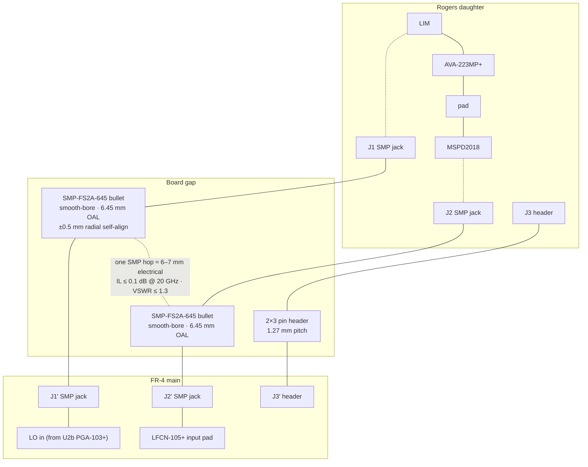

Stack‑up dimensions: Rogers daughter **0.51 mm thick, 25 × 40 mm**;
board gap **~5–6 mm**, held by **M2.5 standoffs × 4**; FR‑4 main
**1.6 mm thick, 4‑layer**.

**Top view of the daughter (25 × 40 mm) and its footprint on the main:**

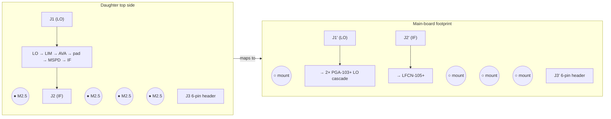

Daughter bottom side is a **solid GND pour**; the main‑board footprint
carries a **GND pour inside the J1' / J2' / standoff fence** for the
cavity return.

**Tolerance budget (what the slotted mounting holes must absorb):**

| Source | Error |
|---|---|
| Rogers daughter outline fab tolerance (JLCPCB) | ±0.2 mm |
| FR‑4 main outline + mount‑hole position | ±0.15 mm |
| SMP jack SMT placement on each board | ±0.10 mm × 2 |
| Standoff hole vs. SMP jack center (design tolerance) | ±0.05 mm |
| **Worst‑case radial misalignment at the RF jack pair** | **~±0.4 mm** |
| **SMP bullet self‑alignment capability (smooth‑bore)** | **±0.5 mm** |

Budget closes with ~0.1 mm of margin, adequate but thin. To recover
more margin, the daughter's four M2.5 standoff holes are **slotted
0.3 mm in the X direction** (along the line between the two SMP
pairs), allowing the daughter to float laterally until the bullets
seat, then clamp via the standoff screws. The SMT jack landing pads
on both boards use the connector vendor's recommended pattern without
shrinkage — any tightening there eats the alignment budget.

**Pin header (J3) notes:**

- 2×3, 1.27 mm pitch, surface‑mount on both boards (e.g., Samtec
  **FTS‑103‑01‑L‑DV** on the daughter + **CLM‑103‑02‑L‑D** on the main,
  or equivalents). Through‑hole is avoided so the daughter's bottom
  GND pour stays unbroken.
- Pinout (looking at the daughter's bottom side, pin 1 top‑left):

  | Pin | Signal | | Pin | Signal |
  |---|---|---|---|---|
  | 1 | +10 V drain | | 2 | GND |
  | 3 | DRAIN_KILL  | | 4 | GND |
  | 5 | V_GG1 (≈−0.8 V) | | 6 | NC (reserved) |

- GND is doubled so the header provides a low‑inductance bias‑return
  path close to the AVA‑223MP+ drain, independent of the standoff /
  SMP‑shell returns.
- Pin 5 carries the AVA‑223MP+ **V_GG1** (gate 1, negative), sourced on
  the main board from a passive divider + filter cap + BZX84C2V4 Zener
  clamp off the A26 W216.5 −15 V rail (no on‑module negative regulator
  — see the *Negative‑rail generation* entry in *Alternatives
  considered*). Tap impedance is R1 ∥ R_bleed (≈1 kΩ) loaded by the
  filter cap; the gate draws only leakage (<1 µA) and the tap feeds the
  daughter through a feedthrough cap at the C2 wall. The VGG1 tap is
  also tapped on the main board by the TLV9004 channel C/D window
  comparator (via the WIN_REF resistor summer that shifts V_GG1 into
  the +5.2 V‑supply common‑mode range) so any drift outside ±0.4 V of
  the tuned V_GG1 point trips DRAIN_KILL.
- **V_GG2** (gate 2, +3.5 V typ) is **not** carried on J3 — it is
  generated on the Rogers daughter by a local passive divider +
  BZX84C3V6 clamp off the +10 V VDD pad, ratiometric with V_DD.
- **Pin 6 is reserved (no‑connect on both boards).** The MSPD2018‑E50
  is a passive SRD + Schottky hybrid (see Open Item 5) and requires
  no daughter‑side supply rail. Pin 6 is left populated on the
  connector but routed to an isolated pad on each side so a future
  revision (e.g. migrating to an active SPD, or a daughter‑side
  diagnostic detector tap) can reclaim the line without a header
  re‑spin. Do **not** hard‑tie pin 6 to +5 V on the main board; an
  accidental short inside the daughter would load an LDO that is
  otherwise un‑committed to the daughter.
- No RF or IF on this header — it's strictly DC.

#### Wall‑crossing inventory (Compartment 2)

Three distinct wall‑crossing methods are used, each matched to the
signal type:

1. **Feedthrough capacitor** (Murata NFM / NFE series) — 3‑terminal
   MLCC mounted so the body grounds to the shield. Passes DC on the
   centre conductor, shunts RF above the corner frequency to the
   shield body. **Used for every DC, bias, logic, and DC‑telemetry
   line** because a simple trace through a slot would conduct cavity
   RF out onto the harness (and vice versa) — there is no selectivity
   without the cap's shunt‑to‑ground path.
2. **Microstrip‑under‑slot** — a 50 Ω trace on the PCB passes under
   a narrow slot cut in the shield frame. No filtering; signal is
   passed through unchanged. **Used only where the crossing signal
   is itself RF that must be preserved.** On A211‑v2 this is the
   one place: the 234 MHz LO between Compartments 1 and 2.
3. **Connector body through the outer enclosure wall** — 3.5 mm
   (X211), SMB (X50, X75), header (W216). The connector
   shell solders into the enclosure wall and seals the shield; the
   signal on the centre conductor is already in a coax / controlled‑
   impedance environment outside the module.

In‑band spur rejection (e.g. LO leak on the IF) is **not** the
feedthrough cap's job — that work is done by dedicated LPF + notch
components on the PCB *inside* the compartment, before the signal
reaches the wall. The notch topology and BOM are in the next
subsection.

All feedthrough caps are Murata, stocked at Mouser (verified November 2026):

| Signal | Dir. | Qty | Part | Value | Case / rating |
|---|---|---|---|---|---|
| +10 V AVA drain | in C2 | 1 | **NFE61PT102E1H9L** | 1 nF | 1206, 50 V, 6 A |
| +5 V IF LNA (AG302‑86G) bias | in C2 | 1 | **NFE61PT102E1H9L** | 1 nF | 1206, 50 V, 6 A |
| V_GG1 AVA (≈−0.8 V typ, passive‑divider tap) | in C2 | 1 | **NFM21CC102R1H3D** | 1 nF | 0805, 50 V, 1 A |
| DRAIN_ENABLE (supervisor → AVA) | in C2 | 1 | **NFM21CC102R1H3D** | 1 nF | 0805, 50 V, 1 A |
| DIAGSAMP (RF‑detector DC out, 0…12 V analog) | out C2 | 1 | **NFM21CC102R1H3D** | 1 nF | 0805, 50 V, 1 A |
| VARSAMP (passive DC divider output off +7.5 V, ~1 V) | out C2 | 1 | **NFM21CC102R1H3D** | 1 nF | 0805, 50 V, 1 A |
| +5.2 V LO drain rail into C1 (2× PGA‑103+, ~194 mA typ / 240 mA max) | in C1 | 1 | **NFE61PT102E1H9L** | 1 nF | 1206, 50 V, 6 A |
| **234 MHz LO, C1 → C2** | C1 → C2 | — | **Microstrip‑under‑slot** (50 Ω trace through a ≤ 1.5 mm slot in shared frame, Eccosorb BSR foam in C1 cavity to damp slot radiation) | — | — |
| 10–80 MHz IF to X75 | out C2 | — | **Connector body through wall** (SMB jack mounted in C2 wall; LO rejection is done by the on‑PCB notch + LFCN‑105+ upstream, not at the crossing) | — | — |
| 2–20 GHz RF from X211 | ext → C2 | — | Connector body through wall (3.5 mm edge‑launch jack mounted in C2 wall) | — | — |

**Locked feedthrough‑cap BOM (per board, both compartments):**

| Mouser / Murata PN | Qty | $ ea | Role |
|---|---|---|---|
| NFM21CC102R1H3D | 4 | ~$0.09 | 1 nF, 0805, 1 A — default bias / signal / telemetry (V_GG1 AVA, DRAIN_ENABLE, DIAGSAMP, VARSAMP; all four are slow DC, 1 nF is the uniform default) |
| NFE61PT102E1H9L | 3 | ~$0.45 | 1 nF, 1206, 6 A — high‑current rails (+10 V AVA drain, +5 V IF LNA, +5.2 V LO drain) |
| **Total** | | **~$1.71** | |

Notes:

- **NFM21CC** (0805, 1 A for 1 nF, 700 mA for ≤ 470 pF) is the workhorse for
  signal / bias / telemetry feedthroughs. 50 V DC rating, ±20 %, Murata
  B characteristic (equivalent to EIA X7R, ±15 %/10 °C over −25…+85 °C).
- **NFE61PT** (1206, 6 A, 50 V) handles the power rails. The +10 V drain rail
  (AVA‑223MP+, 300 mA) and +5 V IF LNA rail (AG302‑86G, 35 mA typ; 80 mA if
  the GALI‑84+ adapter fallback is fitted) both fit inside the 6 A rating
  with >10× margin, so derating for temperature / DC bias is non‑issue.
- Corner / SRF numbers (from Murata S‑parameter files): NFM21CC 1 nF has
  insertion‑loss −3 dB at ~30 MHz, ≥ 25 dB at 200 MHz, ≥ 35 dB at 1 GHz,
  peak attenuation ~45 dB near 500 MHz. NFE61PT 1 nF is lower‑Q because of
  the higher current path, −3 dB at ~20 MHz, ≥ 20 dB at 200 MHz,
  ≥ 30 dB at 1 GHz. Both exceed the ≥ 20 dB target at the 234 MHz LO.
- All three part numbers are Mouser stocked (Mouser catalogue November 2026);
  NFM21CC variants also available from DigiKey, Farnell, Arrow if Mouser
  runs short.

#### IF‑chain LO‑rejection notch (on‑PCB, inside Compartment 2)

The IF chain's job is to deliver clean 10.3–15.6 MHz IF to X75 while
rejecting the 206–234 MHz LO that leaks capacitively and via the
MSPD LO port. The rejection budget:

| Stage | Rejection at LO (206–234 MHz) |
|---|---|
| MSPD2018 internal LO‑to‑IF isolation (datasheet) | ~25 dB |
| **LFCN‑105+ LPF** (7‑section LTCC, DC‑105 MHz) | **35–45 dB** across 200–250 MHz, datasheet typ. |
| **Discrete 2‑stage series‑LC shunt notch** (this subsection) | **35–45 dB** extra, tuned to cover 206–234 MHz |
| **Total LO rejection at X75** | **≥ 95 dB**, well above a ‑70 dBc spur target |

**Why a notch and not just a lower‑corner LPF:** the IF passband
extends to 15.6 MHz and has to be flat to ±0.5 dB there. The nearest
unwanted tone (LO fundamental) is ~13× higher at the low end of the
LO sweep. A 7‑section LPF already handles most of the rejection; a
shallow notch placed inside the LPF's stopband adds another 20+ dB
without costing any passband flatness.

**Topology — series‑LC shunt, two stages, staggered tuning:**

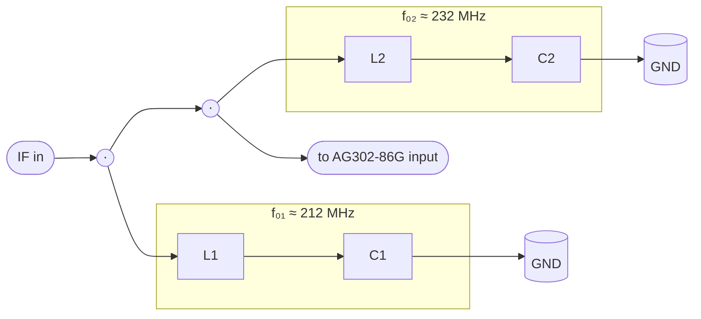

Each stage is a series LC from signal trace to ground pour. At its
resonance the branch impedance is just the inductor ESR (≈ 2 Ω for
a Q = 60 wirewound), shunting the LO to ground. Staggering the two
resonances ~20 MHz apart widens the combined notch to cover the
full 206–234 MHz LO sweep with ≥ 20 dB each, ≥ 35 dB in the overlap.

**Component values and BOM** (all Mouser‑stocked):

| Ref | Value | Part | Mouser | Cost |
|---|---|---|---|---|
| L1 | 120 nH ±10 %, Q ≥ 60 @ 250 MHz | **Johanson LRW0805WKR12GG001E** *(in stock, L805W kit)* — 0805 wirewound ceramic, 120 nH ±10 %, DCR 0.48 Ω, Irms 500 mA, Q ≥ 60 typ @ 250 MHz, SRF > 1 GHz. **Fallback (tighter tolerance / smaller footprint):** Coilcraft **0603CS‑121XJLU** — 0603 wirewound Q‑spec, 120 nH ±5 %, Q ≈ 65 @ 210 MHz. Use only if layout review rejects the 0805 pad or Build 1 measurement shows ±10 % drives notch depth below the 20 dB per‑stage floor (4.7 pF B‑tolerance cap plus ±10 % L gives ≈ ±5 % f₀ error — comfortably inside the Q ≈ 60 / 3 dB BW of the staggered notch). | [JLCPCB LRW0805WKR12](https://jlcpcb.com/partdetail/18694942-LRW0805WKR12GG001E/C17565714) · [Mouser 0603CS](https://www.mouser.com/c/?q=0603CS-121XJLU) | stock |
| C1 | 4.7 pF ±0.1 pF, NP0, 0402 | **Murata GRM1555C1H4R7BA01D** — **external buy** (the in‑house Murata GRM15‑KIT ships the 4.7 pF slot as GRM1555C1H4R7**C**Z01D ±0.25 pF; at C‑tolerance the ±5 % C drives ~±6 MHz f₀ error, roughly 2× the Q‑60 notch 3 dB bandwidth, collapsing depth from 35 dB to 10–15 dB at the target frequency — B‑class required) | [Mouser](https://www.mouser.com/c/?q=GRM1555C1H4R7BA01D) | ~$0.10 |
| L2 | 100 nH ±10 %, Q ≈ 57 @ 250 MHz | **Johanson LRW0805WKR10GG001E** *(in stock, L805W kit)* — 0805 wirewound ceramic, 100 nH ±10 %, DCR 0.43 Ω, Irms 500 mA, Q 57 @ 250 MHz, SRF 1.2 GHz. **Fallback (tighter tolerance / smaller footprint):** Coilcraft **0603CS‑101XJLU** — 0603 wirewound Q‑spec, 100 nH ±5 %, Q ≈ 70 @ 230 MHz. Same fallback conditions as L1 (0805 pad rejected in layout, or ±10 % L drives f₀ outside Q ≈ 60 / 3 dB BW). | [JLCPCB LRW0805WKR10](https://jlcpcb.com/partdetail/18561530-LRW0805WKR10GG001E/C17432340) · [Mouser 0603CS](https://www.mouser.com/c/?q=0603CS-101XJLU) | stock |
| C2 | 4.7 pF ±0.1 pF, NP0, 0402 | **Murata GRM1555C1H4R7BA01D** | same as C1 | ~$0.10 |

Resonances computed as f₀ = 1/(2π√LC):

- L1 × C1: 120 nH × 4.7 pF → **212 MHz**
- L2 × C2: 100 nH × 4.7 pF → **232 MHz**

Tolerance stack: ±5% L + ±0.1 pF C → f₀ shift of about ±3 MHz,
small compared with the 20 MHz stagger. No trimming required.

**Passband impact at IF upper end (15.6 MHz):**

Each shunt branch presents |Xc − Xl| to ground. At 15.6 MHz,
Xc(4.7 pF) ≈ 2 170 Ω, Xl(120 nH) ≈ 12 Ω → branch impedance ≈
2 160 Ω. Two branches in parallel ≈ 1 080 Ω shunting a 50 Ω line:
insertion loss ≈ **0.2 dB at 15.6 MHz, < 0.05 dB at 10.3 MHz.**
Negligible.

**Layout requirements** (these dominate whether you actually get
the predicted 35+ dB notch or a disappointing 15 dB):

- **Ground return via directly under each shunt capacitor's ground
  pad** — one via, 0.3 mm drill, 0.6 mm pad, stitched to the bottom
  ground pour. Any extra inductance in the ground return shifts the
  notch up and flattens it.
- **Both notch stages on the same microstrip segment**, spaced
  ≥ 5 mm apart so their magnetic fields don't couple into each
  other's inductors. 0603CS inductors radiate mostly off their
  ends — orient L1 and L2 **perpendicular** to the IF trace and
  **parallel to each other**, not coaxial.
- **Keep the notch block away from the MSPD IF output pin by at
  least 10 mm** — the MSPD pin is the source of the LO leak being
  notched; coupling back across the notch defeats the filter. Put
  the LFCN‑105+ between the MSPD and the notch.
- **No ground pour directly under the inductor bodies** — the
  0603CS series specifies a keepout of 0.5 mm under the winding to
  keep Q high. On a 4‑layer FR‑4 IF‑chain prototype this means
  voiding the inner ground plane beneath the inductor as well, per
  Coilcraft's Doc787 recommendation for high‑Q chip inductors.
- **Via fence around the notch block** is optional on the IF chain
  (low frequency, low radiation) but cheap; add one row of ground
  vias on each side of the trace, pitch 2–3 mm.
- **Test the notch during Build 3** (IF‑chain populate on the main
  board) — a VNA sweep 10 MHz – 500 MHz with both notches populated
  should show two distinct nulls ≥ 20 dB each, combined ≥ 35 dB across
  206–234 MHz. The DNP pickoff pads after LFCN‑105+ and after the
  notch (populated for Build 3 only) let you decompose per stage.
  If the depth is < 25 dB, the most likely cause is ground‑via
  inductance; add parallel vias.

**Total notch BOM: ~$1.40 per board** (2× 0603CS inductor +
2× NP0 cap + 4× via).

### Headline BOM cost (one built module, both PCBs)

| Block | Approx. parts cost |
|---|---|
| SPD (MSPD2018‑E50) | ~$95 |
| RF buffer (AVA‑223MP+) + limiter + Pad3 (Kyocera AT0603C09 + Ohmite TFA16C04) | ~$127 |
| LO chain | ~$30 |
| IF chain | ~$9 (LFCN‑105+, discrete LC notch, AG302‑86G LNA; no post‑LNA trim pad needed because AG302‑86G's native 15.6 dB lands X75 inside A10's 0 ± 5 dBm without an attenuator) |
| Bias + supervisor + telemetry | ~$29 (OPA2180 zero‑drift DIAGSAMP buffer, TLV9004 quad supervisor, BAT54S detector, PDZ12BGWJ clamp, VARSAMP divider, GBIAS1/GBIAS2 passive gate‑bias networks) |
| Connectors / shield / misc passives | ~$98 (3.5 mm X211 @ ~$22 + **2× SMB 132136 @ $9** + W216 header + 2× shield + **2× SMP‑FS2A‑645 bullets @ $6** + **4× SMP‑MSSB PCB jacks @ $6** (2× PCS17T SMT on daughter + 2× PCT‑10 TH on main) + **2×3 1.27 mm header pair @ $5** + 4× M2.5 standoffs @ $1 + ~$1.71 locked feedthrough caps across both compartments) |
| **Total, one built module** | **~$396** — sum of the rows above; the two PGA‑103+ LO stages, Pad_IS, Pad2, per‑stage RFCs, and the second LT3045 are all already counted in the LO‑chain and bias lines. |

PCB cost adds ~$15 for the hybrid Rogers daughter + FR‑4 main stack‑up.
The board‑to‑board SMP interconnect (~$36 — bullets + jacks rated to
20 GHz) is what delivers the ≤ 0.1 dB / ≤ 1.3 VSWR hop performance;
a cheaper generic bullet would roll off in the top octave. Bench‑side
adapters (see "Test & bring‑up cables" above) are a **one‑time
~$134 VAT‑incl lab purchase** for the locked core (2× Amphenol
**095‑902‑581‑006** TFlex 405 R/A cables, 26.5 GHz, LD‑verified via
the 500 mating‑cycle datasheet spec), plus an optional ~$15 AliExpress
spare cable for a ~$149 full kit; X211 needs no adapter because the
3.5 mm board jack mates directly with any SMA / 3.5 mm bench cable
already in the drawer. An optional **+~$400** precision cable upgrade
is deferred until Phase B VNA work shows it's needed. None of the
bench kit is included in the module total.

### Passive sizing conventions

Default package sizes for the whole board, stated once here so schematic
capture and later BOM work can use a single rule instead of re‑litigating
every part. Deviations from the default are listed in the second table and
are each locked by a physical requirement that overrides the convention.

**Default (applies unless overridden below):**

| Class | Value range | Package | Dielectric |
|---|---|---|---|
| Decoupling / bypass | 1 nF – 1 µF | **0603** | X7R |
| LDO / bulk mid‑range | 2.2 µF – 10 µF | **0603** | X7R (if available at value + voltage) |
| Pull‑up / pull‑down, timing | any | **0603** | thick‑film |
| Feedback / divider resistors | any | **0603** | thin‑film 1 % |
| Signal‑path series R (IF, control) | any | **0603** | thick‑film |

Rule of thumb: **"0603 X7R 0.1 µF"** is the default decoupling part and
should not be called out explicitly on schematics — only deviations need a
value / package annotation.

**Default 100 nF stock part — voltage‑split by rail:**
- On ≤ +7.5 V rails (supervisor, LDO outputs, MMIC drains on PGA / AG302,
  logic bypass): **Kemet C0603C104K4RACTU** (0603 X7R, 16 V, ±10 %, stock).
  V_applied / V_rated ≤ 47 % → ≤ 30 % DC‑bias loss.
- On +10 V / +15 V / −15 V rails (LT3045 #1 in/out bulk, AVA drain bypass):
  **Samsung CL10B104MB8NNNC** (0603 X7R, 50 V, ±20 %, stock). 16 V parts
  derate to ≥ 60 % C loss at V_applied = +10…+15 V and become marginal as
  decoupling; 50 V keeps ≤ 10 % loss. ±20 % tolerance is non‑binding for
  bypass. Three slots in the module (LT3045 #1 V_IN, LT3045 #1 V_OUT, AVA
  C_BYPASS) use the 50 V part; all other 0603 100 nF positions use the
  Kemet 16 V part.

**Discretionary downsize to 0402** is acceptable anywhere 0603 is listed
above if layout is tight — typically around the MMICs, under shield
frames, or along the bias ladder between a pin and the first decoupling
stage. No rework penalty on hand‑assembly since the prototype uses stencil
paste reflow, and JLCPCB standard assembly covers 0402 at the same yield
as 0603. Value / voltage / dielectric stay the same; only the case shrinks.

**Forced deviations (physical requirement wins over the default):**

| Location | Part | Package | Reason |
|---|---|---|---|
| First cap at any MMIC RF pin | 100 pF NP0 (**Murata GCM1555C1H101FA16J** automotive C0G, 50 V, ±1 % F — primary; **Murata GRM1555C1H101JD01D** C0G, 50 V, ±5 % J — alt; both from stock) | **0402** | ESL at 10–20 GHz — 0402 ≈ 0.4 nH vs 0603 ≈ 0.6 nH mounted loop; matters for AVA‑223MP+ and MSPD LO/RF pins |
| Signal‑path DC‑block / coupling (LO, RF, IF) | 1 nF NP0 (**Murata GRM1555C1H102JA01D**, 50 V, ±5 % J, from stock) | **0402** | Q and SRF on the signal path |
| Notch caps (IF LO‑reject) | 4.7 pF NP0 **±0.1 pF (B)** — **Murata GRM1555C1H4R7BA01D** (external buy; kit GRM15 ships the 4R7C ±0.25 pF variant which won't hold 35 dB notch depth) | **0402** | C0G tolerance + self‑resonance above 234 MHz; B‑class tolerance is the design‑driver — ±5 % at 4.7 pF is ~±6 MHz f₀, 2× the notch 3 dB BW |
| Notch inductors (IF LO‑reject) | 100 / 120 nH | **0603** (Coilcraft 0603CS, Q ≈ 65–70 @ 210–230 MHz) · **stock alt 0805** (Johanson L805W wirewound, Q 57 @ 250 MHz) | Wirewound ceramic core with Q ≥ 60 at 220 MHz needed for ≥ 35 dB notch depth; reconcile with L1/L2 BOM rows above |
| Signal‑path attenuator, RF path (2–20 GHz, Pad3) | monolithic chip attenuator, per pad dB | **Kyocera AVX AT0603C** (AlN, 0.75 W, mainline C‑variant) + **Ohmite TFA16C** (0603, 64 mW) | DC–20 GHz flat response; discrete pi‑pads (wraparound thin‑film or thick‑film chip R's) roll off above ~6 GHz due to end‑cap inductance, so RF Pad3 must be monolithic. Iron‑reworkable (two‑terminal chip on a standard 0603 pad pattern, no bottom GND). **Cost‑down alternative:** all‑Ohmite 2+4+7 cascade (`TFA32C02DBER` 1206 + `TFA32C04DBER` 1206 + `TFA16C07DBER` 0603) — passes 3× derate at every stage, ≈ $2.70 vs ≈ $15 for the Kyocera path, but adds ~6 mm strip length on the Rogers daughter and 2 extra RF launches. |
| Signal‑path attenuator, LO / IF paths (DC–300 MHz) | 3‑resistor discrete T‑pad | **0805 thin‑film 1 % TCR ≤ 100 ppm/°C** across Pad1 / Pad_IS / Pad2 and any IF trim pad (single body size forced by Pad2 dissipation, used everywhere for BOM uniformity) | Trim‑by‑swap on the bench with an iron. No bottom GND pad — unlike 3‑terminal monolithic pi‑pads (e.g. Susumu **PAT0816** 0603 64 mW / **PAT1220** 0805 100 mW, DC–10 GHz) which carry a bottom ground terminal and are hot‑air only. Vendor product lines in the T‑pad resistor spec under "LO chain rationale". |
| LDO input / output bulk on ≤ +7.5 V rails (LT3045 #2 in/out, ADM7154 in/out) | 10 µF X5R 16 V — **Samsung CL21A106KOQNNNE** (stock) | **0805** | Value × voltage forces the size; 16 V rating gives ≤ 47 % V_rated derating on +7.5 V, ≤ 33 % on +5.2 V |
| LDO input on +15 V rail + bulk on +10 V drain rail (LT3045 #1 in, LT3045 #1 out, AVA C_BULK) | 10 µF X5R 50 V — **Taiyo Yuden UMK316BBJ106KL-T** (stock) | **1206** | 50 V rating forced by DC‑bias derating on +10 V / +15 V — 0805 16 V parts lose 50–70 % of C at rated V on +10 V (doc previously flagged this); 0603 10 µF at ≥ 25 V is borderline at 1206 footprint. 1206 keeps effective C ≥ 8 µF at both V_applied points. X5R substituted for X7R — operating envelope 0…+60 °C is fully inside X5R's −55…+85 °C spec. |
| Feedthrough caps (harness → shield wall) | 1 nF NP0 / 10 nF X7R | **NFM21 0805 / NFE61 1206** | Locked by the 3‑terminal feedthrough family case style |
| MMIC bias‑ladder ferrite bead (per MMIC, upstream of 10 µF bulk) | 220 Ω @ 100 MHz TDK MPZ series | **0603 MPZ1608S221A** on 2× PGA‑103+ (LO chain) · **0805 MPZ2012S221A** on AVA‑223MP+ and AG302‑86G | Mixed case is area‑driven, not electrical: the LO compartment is the densest section (2× PGA + pads + RFCs + L_stab/R_stab in Compartment 1), so the PGA feeds drop to 0603; the AVA (Rogers daughter) and AG302 (IF chain) have room for the higher‑Irms 0805 part and benefit from its 40 mΩ DCR / 3 A margin. Both variants are lossy MPZ "power beads" — high‑Q MMZ / BLM15GG on the bias rail would gain‑peak with the 10 µF bulk (see ladder bullet). Both from existing kit stock. |
| Any cap ≥ 22 µF | 22 µF+ X7R / tantalum | **1206 / electrolytic** | Value forces the size |

Everything else — supervisor bypass, logic bypass, bias ladder mid‑ and
bulk‑stage, telemetry filtering — defaults to **0603 X7R**.

**MMIC bias ladder (applies to AVA‑223MP+, 2× PGA‑103+, AG302‑86G):**

Each MMIC drain / Vcc pin gets a four‑stage ladder placed in order from
the pin outward toward the LDO, with the smallest cap closest to the pin:

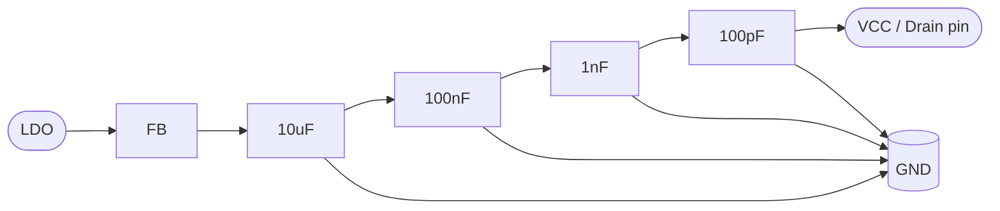

- **100 pF NP0 0402** (**Murata GCM1555C1H101FA16J** primary / **GRM1555C1H101JD01D** alt, both from stock) — kills the 10–20 GHz RF leakage at the pin (AVA‑223MP+);
  for the 2× PGA‑103+ LO stages the 100 pF dominant‑SRF falls near 234 MHz, and
  for AG302‑86G (10–80 MHz IF band, below the cap's SRF) the 100 pF remains
  dominantly capacitive and the low‑MHz decoupling work is handled by the 1 nF
  and 100 nF stages below — the ladder topology is identical across all four
  MMICs, only the stage that carries the decoupling work shifts with frequency.
  On the PGA‑103+ stages the ladder feeds **directly** from the +5.2 V LT3045
  rail through the FB + RFC — no Rbias ballast resistor (removed to keep ~1.3 W
  of dropout heat out of Compartment 1; regulator current‑limit replaces
  the ballast's short‑circuit protection).
- **1 nF X7R 0603** — mid‑band bypass (100 MHz – 1 GHz), catches LO harmonics
  and any out‑of‑band content that slips past the first cap.
- **100 nF X7R 0603** — low‑MHz bypass, plus the standard default decoupling
  value on the board.
- **10 µF X5R** — bulk / rail stability and supervisor loop margin. Package
  is rail‑dependent: **1206 50 V** (Taiyo Yuden UMK316BBJ106KL‑T) on AVA
  +10 V; **0805 16 V** (Samsung CL21A106KOQNNNE) on PGA +5.2 V and
  AG302 +5 V.
- **220 Ω @ 100 MHz ferrite bead (FB)** — lossy TDK MPZ series "power bead"
  between the LDO output and the bulk cap, one per MMIC bias feed. Provides
  rail isolation in the 100 MHz – 1 GHz band that the cap ladder alone cannot
  deliver (caps look inductive above their SRF; the bead's resistive loss
  picks up exactly there). Two secondary roles: (a) on the shared +5.2 V LO
  rail it decouples the two PGA‑103+ stages from each other across the LT3045
  output, breaking the bulk‑cap common‑impedance path between U2a and U2b;
  (b) on every rail it keeps MMIC‑generated RF out of the LT3045 error loop,
  preserving the regulator's own PSRR rather than asking the loop to absorb
  GHz‑region content it was never designed for. MPZ is chosen deliberately
  over the higher‑Q MMZ / BLM15GG family because the bead forms an RL with
  the 10 µF bulk and would gain‑peak with a high‑Q part; MPZ's resistive
  loss flattens that resonance. DCR × Idc of 40–80 mΩ × 35–300 mA lands
  3–24 mV of headroom loss — negligible on every rail. Mixed‑case BOM
  (0603 on the 2 PGA stages, 0805 MPZ2012S221A everywhere else) is
  area‑driven only, not electrical — see LO chain BOM and the size
  standardization table below.

Ground return for the 100 pF and 1 nF must be a dedicated via to the
inner ground plane, directly next to the pad, not shared with the other
ladder stages (shared return inductance kills the decoupling at the pin).

### Bare‑board fabrication (hybrid Rogers + FR‑4, JLCPCB, 5 pc)

The module ships as two PCBs, each ordered from JLCPCB on a different
service tier. Both use ENIG finish.

**Rogers RF‑core daughter** (JLCPCB high‑frequency service):

| Parameter | Value |
|---|---|
| Material | Rogers **RO4350B** (Dk 3.48, Df 0.0037) |
| Layer count | **2** (JLCPCB HF service only offers 2‑layer Rogers) |
| Thickness | **0.51 mm** (20 mil — 50 Ω microstrip ≈ 1.15 mm wide) |
| Copper | 1 oz outer, ENIG finish |
| Board size | ≤ 25 × 40 mm (1 000 mm²) |
| 5 pc price | **~$50–60** |
| Min. trace / space | 5/5 mil (OK for AVA‑223MP+ 32‑QFN and MSPD2018) |
| Min. drilled hole | 0.3 mm (OK for MSPD ground‑paddle via farm) |
| Lead time | 4–5 working days + shipping |

**FR‑4 4‑layer main board** (JLCPCB standard 4‑layer service):

| Parameter | Value |
|---|---|
| Material | FR‑4, Tg ≥ 150 °C |
| Layer count | **4** (top signal, inner GND, inner PWR, bottom signal) |
| Thickness | 1.6 mm (0.2 mm outer prepreg → tight ground reference for LO/IF traces) |
| Copper | 1 oz outer, 0.5 oz inner, ENIG finish |
| Board size | ~80 × 120 mm typical |
| 5 pc price | **~$15–25** (JLCPCB 4‑layer standard tier) |
| Min. trace / space | 4/4 mil |
| Lead time | 2–4 working days + shipping |

**Total PCB cost for one prototype set (Rogers + FR‑4, 5 pc each):**
**~$70–85**. Compare to a hypothetical single 4‑layer Rogers board
(not offered by JLCPCB; ~$250–500 at specialist fabs) or the previous
single 2‑layer RO4350B plan (~$100–150 for the same usable area but
with no buried ground plane on the main board).

Why the split is fab‑friendly, not fab‑unfriendly:

- JLCPCB's HF Rogers service is **2‑layer only**, and the LO / IF
  blocks really want a 4‑layer stack‑up. Keeping them on the FR‑4 main
  board gets 4‑layer routing without paying for custom hybrid stack‑up
  (which only specialist fabs like Multi‑CB or PCBWay Advanced offer,
  at 5–10× the price and 3–4 weeks lead time).
- The Rogers daughter is small enough to fit in the $47 tier of the
  JLCPCB Rogers service (50 × 50 mm), leaving room on the panel for
  multiple revisions if the first spin needs tuning.
- Both boards can be re‑spun independently — a Rogers daughter re‑spin
  costs ~$50, not ~$100–150, and doesn't force a re‑order of the
  (larger) main board.

Fallback: if Rogers inventory or lead time becomes a problem, the
same daughter footprint can be made on Taconic TLX‑8 or Isola IS680
at a few specialist fabs; pin‑out stays identical so the main board
is unaffected.

## Prototype strategy — de‑risk before the full A211‑v2

The hybrid Rogers‑daughter + FR‑4‑main architecture makes the staged
build almost free, because the prototype flow reduces to **two PCB
designs, brought up in four populated configurations**:

- **Phase B Rogers daughter** — designed once as the final Phase C
  daughter, built early with the MSPD2018 unpopulated, then the same
  boards are reworked or re‑fabbed with the MSPD to become the Phase C
  daughter directly.
- **FR‑4 main board** — designed once as the final Phase C main board,
  ordered up front, and **populated in four staged builds (Build 1 →
  Build 4)**. Each build adds one functional block; earlier builds
  serve as the bench test vehicle for the block under test. Build 4 is
  the production configuration.

No dedicated Phase A sub‑board designs, no throw‑away PCBs. The one
enabling provision is a small **DNP "bring‑up kit"** (dummy loads +
pickoff pads, ~$3 of parts shipped loose with the PCB order) that
turns the main board into a safe supervisor test vehicle in Build 1
and a decomposable IF‑chain test vehicle in Build 3. The kit is
specified in the subsection below.

### Phase A — staged population of the main board (Builds 1–3)

Order 5 pc of the Phase C main board on the first run. Each Phase A
build is the same PCB with a different populated subset; parts from
earlier builds stay in place and roll into the next.

| Build | What gets populated | What stays DNP | What it proves |
|---|---|---|---|
| **Build 1 — supervisor + VARSAMP stand‑alone** | LT3045 +10 V / ADM7154 +5 V LDOs + input caps; TPS3808G01 + TLV9004 (quad) + BSS308PE supervisor (rail protection only, all on +5.2 V); VARSAMP divider (2.80 kΩ 0603 + 432 Ω 0805, 0.1 % 10 ppm precision kit) off W216.4; **DNP dummy‑load kit** (R_SELb + R_DUMMY + LED) on each MMIC drain pad | All MMICs, LO chain, IF chain, DIAGSAMP detector/buffer, Rogers daughter, shield cans, all connectors beyond the +15 V / +7.5 V / logic harness | Drain kill ≤ 10 µs after any rail sag on +10 V or +5.2 V; window‑comparator trip points; LDO output noise; quiescent draw; **VARSAMP on W216.9 reads 1.00 ±0.05 V across VA7.5‑P spec range** (dial VA7.5‑P from 7.25 V to 7.75 V on the bench PSU, watch VARSAMP stay inside 0.9–1.1 V). LEDs on dummy loads blink off = kill works. DIAGSAMP is expected to read ~0 V at this build (LO chain absent, detector gets no drive). |
| **Build 2 — + LO chain + DIAGSAMP detector** | Add Pad1, JMS‑1H+, BFCN‑212+, U2a PGA‑103+, Pad_IS, U2b PGA‑103+, Pad2, per‑stage RFCs + bias decoupling ladder; LT3045 #2 populated at +5.2 V (I_lim = 250 mA); **DIAGSAMP front end** (Cpick + BAT54S + smoothing RC + OPA2180 buffer + PDZ12BGWJ clamp). Dummy loads stay fitted on AVA / 2× PGA / AG302‑86G. | AVA‑223MP+, MSPD2018, IF chain still DNP | Inject 103–117 MHz at X50; measure at **J1' SMP bullet‑pull** (pull the bullet on the main‑board side, mate an SMP‑to‑SMA adapter). Verify 206–234 MHz out at +19 dBm ±0.5 dB flat, 110 MHz feedthrough ≤ −20 dBc, 3rd‑harmonic (~660 MHz) ≤ −30 dBc, total LO‑chain draw ≈ 194 mA typ on the +5.2 V rail (≤ 240 mA worst‑case), both MMICs inside 60 °C rise. Low‑frequency stability: no oscillation on spectrum analyzer 1 MHz–500 MHz with input open/short/50 Ω. **DIAGSAMP bring‑up:** measure W216.10 across the LO sweep; trim Cpick (0.5 → 2 pF ladder pads laid in) and/or OPA2180 gain resistors until DIAGSAMP reads 8–10 V across 206…234 MHz at nominal drive; verify it drops below 7.5 V when LO input at X50 is removed. |
| **Build 3 — + IF chain** | Add LFCN‑105+, 2‑stage series‑LC LO‑rejection notch (f₀ ≈ 212 / 232 MHz), AG302‑86G (pre‑screened per `ag302_86g_screening_plan.md`). DNP pickoff pads after LFCN‑105+ and after notch are populated for this build only, removed in Build 4. | AVA‑223MP+, MSPD2018, Rogers daughter still DNP | Inject 10.3–15.6 MHz at the IF SMP jack (daughter side, bullet pulled), measure at X75. Verify **gain +15 dB ±0.5 dB flat** across 10.3–15.6 MHz (LPF −0.5 + notch −0.2 + AG302‑86G +15.6 = +14.9 dB net), notch depth ≥ 35 dB across 206–234 MHz, passband loss ≤ 0.5 dB at 15.6 MHz, NF, P1dB. **X75 output level check:** with the MSPD populated and nominal RF / LO drive, confirm X75 lands inside A10's 0 ± 5 dBm acceptance across 2–20 GHz RF sweep (worst case ≈ −4.1 dBm @ 20 GHz band edge / CL = 22 dB, typical ≈ −0.1 dBm mid-band / CL = 18 dB). If X75 comes out > +1 dBm (AG302 screened Id at the high side of the 30–40 mA window, or MSPD CL mid‑band below 18 dB), add a 1–2 dB **discrete 0805 T‑pad** at the optional IF‑trim footprint between notch and AG302 input (iron‑reworkable; per the T‑pad resistor spec). If notch under‑performs, pickoff pads let you decompose per stage. |

**Phase A incremental cost:** ~$3 for the DNP bring‑up kit shipped
with the BOM (R_SELa/b selectors, R_DUMMY, LED + 1 kΩ, pickoff‑pad
series resistors). All other parts used in Builds 1–3 are parts that
were going to be fitted to the production module anyway, so there is
**no duplicate parts cost**. The main board PCB ordered up front
(~$20 for 5 pc) serves Phase A, Phase B bias harness, and Phase C in
the same order — not a Phase A‑specific fab.

**Phase B bias supply:** Phase B (Rogers daughter bring‑up) plugs into
the main board's J3′ pin header once the main board has reached
Build 2 or Build 3, using the supervisor‑protected +10 V rail and the
V_GG1 tap (≈−0.8 V typ) the main board already provides. V_GG2 is
generated on the daughter itself, local to the AVA VGG2 pin, so no
extra J3 pin is needed. No separate bias board is needed.

**Optional fallback:** if Build 3 measures notch depth < 30 dB across
206–234 MHz, a small dedicated **IF‑notch trim sub‑board** can be
ordered on demand (~$20, 4‑day JLCPCB turnaround). Layout is trivial
(2×2 cm, parallel footprints for 3× inductor choices × 2× cap choices
per stage, 2× SMA). The main board's notch values get updated to the
trim‑board winners before Build 4 rework. This is a last‑resort lane,
not a planned phase.

### DNP bring‑up kit on the main board

The staged build relies on a small set of **Do‑Not‑Populate**
footprints laid into the main‑board layout and shipped as loose
parts in the BOM kit. They turn the production PCB into a safe
supervisor test vehicle and a decomposable IF test vehicle without
building dedicated sub‑boards.

**Per‑MMIC dummy‑load selector** (applied identically to AVA‑223MP+,
2× PGA‑103+, AG302‑86G):

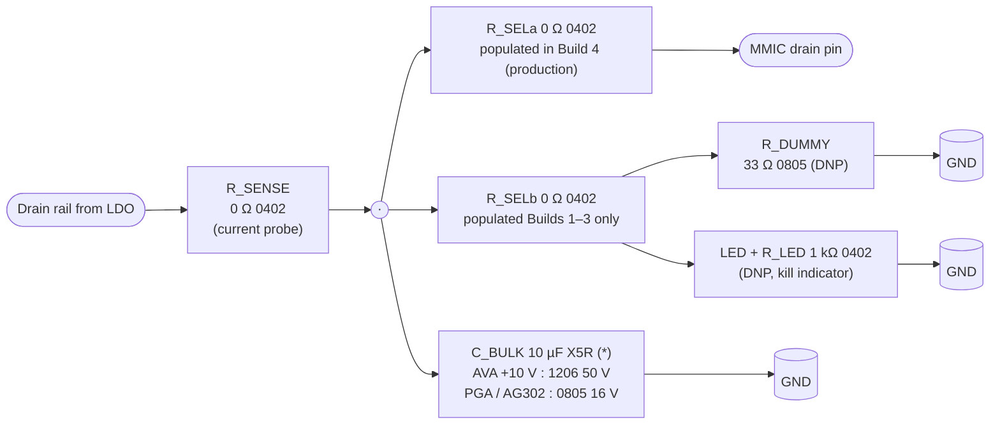

- **Builds 1–3 (supervisor / LO / IF bring‑up)**: populate R_SELb,
  R_DUMMY, LED + R_LED. R_SELa is DNP. No MMIC on the pad. Rail‑sag
  tests trip the supervisor; LED blinks off within the kill window;
  failure mode is a dead 33 Ω resistor, not an $85 MMIC.
- **R_DUMMY is a sacrificial, pulse‑rated part — not a continuous load.**
  33 Ω on the +10 V AVA rail dissipates 3 W continuous, ~0.8 W on the
  +5 V / +5.2 V PGA / AG302 rails; both exceed the 0805 thick‑film
  125 mW rating by 6–24×. Use generic **0805 33 Ω 5 % thick‑film from
  stock** (tolerance is non‑binding; this is a coarse load). Bring‑up
  procedure: apply rail, observe LED + supervisor response, remove rail
  within ≤ 1 s per cycle. Each 0805 tolerates ≈ 40 ms at 3 W before
  thermal damage, so short‑pulse testing is fine; accept the part may
  fail open after ~20 cycles and replace from the same reel. Stock
  2–3 spares per footprint in the kit.
- **Build 4 (production)**: de‑solder R_SELb / R_DUMMY / LED + R_LED;
  fit R_SELa; solder the MMIC onto its pad.

Three instances (one per protected MMIC). Total DNP parts shipped
with the BOM kit: 3× R_SELb + 3× R_DUMMY + 3× LED + 3× R_LED ≈ **~$2**.
Board‑area penalty per MMIC: ~3 mm² (four small 0402/0805 footprints).

**IF‑chain pickoff pads** — at two locations: after LFCN‑105+ output
and after the 2‑stage notch output (before AG302‑86G). Each pad is:

- 0402 **1 kΩ DNP** in series off the main trace (acts as a high‑
  impedance tap, negligible loading if left DNP)
- 1.27 mm drilled pad to ground next to it for a probe clip

Populated during Build 3 if notch decomposition is needed; removed
for Build 4 so there is no spur tap on the production IF path. Two
instances, ~$0.50 total.

**LO‑chain pickoff pads** (optional, same pattern): four locations
along the LO cascade (JMS‑1H+ output, BFCN‑212+ output, U2a PGA‑103+
output, U2b PGA‑103+ output). DNP by default; populated only if Build 2 shows unexpected
harmonic content and stage‑by‑stage decomposition is required. Three
instances, ~$0.75 total.

**Total DNP kit**: ~**$3** of loose parts shipped in the main‑board
BOM bag, ~**15 mm²** of main‑board area across the whole kit (noise
against a ~10 000 mm² main board). No schematic or net changes
between Phase A and Build 4 — only which parts are soldered down.

### Phase B — Rogers RF‑core daughter (the Phase C daughter, built early)

One Rogers RO4350B board, 25 × 40 mm, **designed as the final Phase C
daughter card** with the MSPD2018 footprint included from day one.
For Phase B the MSPD is left unpopulated and its RF port is routed
out to an extra SMP launch so the limiter / AVA / pad chain can be
characterised end‑to‑end on a VNA as if the MSPD were just a 50 Ω
load.

| Item | Part | $ / unit |
|---|---|---|
| Limiter | MADL‑011022 | ~$12 |
| RF buffer | **AVA‑223MP+** | ~$85 |
| RF‑path attenuator (Pad3) | 1× **Kyocera AVX AT0603C09ECATB** (9 dB, 0.75 W) + 1× **Ohmite TFA16C04DBER** (4 dB, default trim; TFA16C01/02/03/05 shelf kit for swap‑trim) | ~$15.30 |
| MSPD2018‑E50 footprint | — (unpopulated in Phase B) | $0 |
| Connectors | 1× 3.5 mm edge‑launch (X211 in) + 3× SMP jumpers (LO in, IF out, RF‑to‑MSPD bypass) + 1× pin header (bias) | ~$41 |
| Bias | plug into the partially‑populated main board (Build 2 or Build 3) via the J3 pin header harness — supervisor‑protected +10 V drain and V_GG1 tap (≈−0.8 V) straight from the production PCB. V_GG2 (+3.5 V, gate 2) is generated on the daughter from the +10 V pad via a local passive divider + Zener clamp. | ~$0 (reused) |
| PCB | JLCPCB RO4350B 0.51 mm ENIG, 25 × 40 mm, 5 pc | **~$55** |
| **Per‑unit parts + PCB share** | | **~$208** |

What Phase B proves on a VNA, before the Phase C FR‑4 main board is
ordered:

- AVA‑223MP+ **forward gain 2–20 GHz** within ±1 dB of the datasheet
  on the actual Rogers stack‑up.
- **Reverse isolation ≥ 40 dB across 2–20 GHz** end‑to‑end through
  the daughter — the entire reason the buffer is in the design.
- **P1dB at 20 GHz ≥ +23 dBm** at the buffer output.
- **Limiter threshold and recovery** for MADL‑011022, measured per the
  method below. A clean recovery spec matters because any residual DC
  charge on the PIN junction lifts the small‑signal insertion loss
  on the 2–20 GHz RF path and corrupts the MSPD RF level during the
  first microseconds after a transient.
  - *Threshold*: CW sweep at 10 GHz (mid‑band), step input from
    +5 dBm to +25 dBm in 1 dB increments, measure output with a
    calibrated power meter. Record `P_in` at which `P_out` departs
    > 0.5 dB from the small‑signal line. Repeat at 2 GHz and 20 GHz
    to capture band‑edge behaviour. Acceptance: `P_thresh` = +18…
    +22 dBm (datasheet typ +20 dBm ± 2 dB across band).
  - *Recovery*: **pulsed** test using a pulse generator + SPDT RF
    switch (e.g. HMC547) ahead of the VNA / spectrum analyzer port.
    Feed a +25 dBm, 1 µs burst into the limiter, then switch to a
    +0 dBm CW probe tone and sample the output envelope with a fast
    peak detector or sampling scope (≥ 1 GHz analog BW, triggered on
    the burst falling edge). Record time from burst‑end to
    `|IL − IL_coldstart| ≤ 0.3 dB`. Acceptance: **recovery ≤ 50 ns**
    across 2–20 GHz, measured on ≥ 3 physical DUTs.
  - CW‑only recovery tests under‑report the real transient (the
    PIN's stored charge equilibrates to a different steady state
    under CW than after a pulse), which is why the pulsed method is
    mandatory. The SPDT switch must have > 30 dB isolation so the
    probe tone is not itself limited during the burst.
- **Microstrip via fencing, ground paddle thermal, pad compensation,
  SMP launch launch‑pad geometry** — all characterised on the exact
  substrate, finish, and connector geometry the production daughter
  uses.
- **SMP jumper insertion loss + VSWR** on the LO and IF ports, so the
  budget between the daughter and the FR‑4 main board is measured,
  not assumed.

**Phase B reuse path:** if all six criteria pass, the **same Rogers
design is re‑ordered (or reworked from the Phase B stock) with the
MSPD2018 populated** and becomes the Phase C daughter card directly.
No redesign step, no second Rogers spin. Budget for one more 5‑pc
Rogers order (~$55) if the Phase B boards get damaged during rework,
but typically 2–3 of the original 5 pc survive and can be reused.

### Phase C — Build 4 (final populate + integration)

Build 4 takes the same main‑board PCB used in Phase A Builds 1–3 and
brings it to production configuration:

- **Rework the DNP bring‑up kit out**: de‑solder R_SELb / R_DUMMY /
  LED on each MMIC drain; fit R_SELa in place of R_SELb. De‑solder
  the IF‑chain pickoff pads (Build 3 diagnostic only).
- **Fit the remaining MMICs** on the main board: AG302‑86G in the IF
  chain (from the screened batch, top unit per `ag302_86g_screening_plan.md`),
  and if not already done, any amplifier whose supervisor relationship was
  verified with dummy loads. Both PGA‑103+ stages are already soldered from
  Build 2.
- **Mount the Phase B Rogers daughter** (now populated with the
  MSPD2018) via the 2× SMP‑FS2A‑645 board‑to‑board bullets (LO, IF)
  and the J3 pin header + 4× M2.5 standoffs.
- **Close the shield**: fit the two Harwin S02 cans over Compartments
  1 and 2, install the feedthrough caps on all harness crossings.
- **Connect the X211 RF input** (3.5 mm, mates with any SMA / 3.5 mm
  bench cable) and the X75 IF output.

Because the main board has already been brought up through Build 3
and the daughter through Phase B, the only genuinely new risk at
Build 4 is **end‑to‑end phase‑detector operation through the MSPD2018**
and the **mechanical daughter‑to‑main interconnect tolerance** (SMP
bullet insertion loss, J3 seating). Everything else — supervisor
timing, LO drive level, IF gain, notch depth, AVA isolation — was
validated earlier without integration masking the results.

Remaining unknowns at Build 4 entry (after Phase A + Phase B):

- MSPD2018‑E50 pad / grounding behaviour on the actual daughter stack‑up
  (MACOM app note coverage).
- Shared‑wall feedthrough cap mounting (mechanical, not RF).
- Board‑to‑board SMP bullet + J3 pin‑header assembly tolerance
  between the two PCBs (mitigated by the slotted standoff holes on
  the daughter).
- End‑to‑end conversion loss and 234 MHz LO leakage at X75 under the
  full shield.

If a layout bug is discovered in Phase A Builds 1–3 that affects the
production configuration, the cost is **one 5‑pc re‑order of the main
board** (~$20, 4‑day turnaround) — cheap enough that it does not
change the phase plan.

### What deliberately is *not* a separate prototype

- **MSPD2018 alone on a carrier board.** A standalone SPD board would
  need the same LO drive, the same RF buffer, the same IF amp, and
  the same bias — i.e. it would duplicate 70 % of A211‑v2 for no
  isolation of risk. The MSPD lives on the Phase B / Phase C daughter;
  Phases A + B de‑risk everything around it.
- **A second Rogers spin between Phase B and Phase C.** The Phase B
  daughter *is* the Phase C daughter — no redesign, just MSPD
  population. Re‑order only if Phase B stock is depleted or damaged
  during rework.
- **Dedicated FR‑4 sub‑boards for supervisor / LO / IF.** Earlier
  drafts of this plan proposed three small sub‑boards for Phase A; the
  main‑board‑as‑Phase‑A approach replaces them, because the main
  board's DNP bring‑up kit (dummy loads + pickoff pads) lets the same
  PCB serve as supervisor test vehicle (Build 1), LO test vehicle
  (Build 2), and IF test vehicle (Build 3) before final populate
  (Build 4). The only residual sub‑board is the optional IF‑notch
  trim board, ordered on demand if Build 3 reveals a depth shortfall.
- **A combined LO + RF + IF proto without the SPD on a single Rogers
  board.** Equivalent to the old single‑Rogers‑board plan with the
  MSPD footprint unpopulated — forces LO and IF onto expensive 2‑layer
  Rogers instead of cheap 4‑layer FR‑4. Hybrid construction removes
  the incentive.

### Phase cost summary (hybrid architecture + main‑board‑as‑Phase‑A)

| Path | PCBs | PCB + parts | When to pick |
|---|---|---|---|
| Single‑shot (Build 4 directly, no Phase A staging) | 2 (FR‑4 main + Rogers daughter) | ~$397 for 1 built unit (~$75 PCB pair + ~$322 parts) | Maximum schedule confidence in every block, willing to risk a $20 main‑board re‑spin if supervisor / LO / IF misses spec. |
| **Staged (Build 1 → Build 2 → Build 3 → Phase B → Build 4)** | 2 (same FR‑4 main, four populated configurations + Rogers daughter) | ~$3 (DNP bring‑up kit, BOM loaded) + ~$208 (Phase B, 1 built on Rogers — parts + PCB share, per line 1464) + ~$230 (Build 4 populate + assembly, reusing Phase B daughter and all Phase A parts) ≈ **~$441 for the full validation path** | Default. Catches supervisor / LO / IF / buffer errors at sub‑board visibility without building dedicated sub‑boards. |
| Contingency: IF‑notch trim sub‑board | +1 small FR‑4 | +~$20 PCB + ~$10 parts if Build 3 notch depth < 30 dB | Only if needed. |

The staged path costs **~$44 more** than the single‑shot path (~$3 DNP
kit + ~$41 of Phase B test‑only launches on the daughter — the
3.5 mm X211 stand‑in and the 3× SMP jumpers for LO‑in / IF‑out /
RF‑to‑MSPD bypass, all used only for standalone VNA characterization);
every main‑board BOM item is still shared across phases, with no
duplicated production parts. Compared to the previous sub‑board staged
plan (~$435) the delta is within noise (~$6 worse); compared to the
original single‑Rogers‑board plan (~$670) it still saves ~$229. The
staged path is the default because the ~$44 premium buys sub‑board
visibility — catching supervisor / LO / IF / buffer errors before
committing to the full stack — and the single‑shot row exists only as
a reference. **Bench‑side adapters** (one‑time, shared across all
phases, not included in any row above) are a **~$134 VAT‑incl locked
core** (2× Amphenol 095‑902‑581‑006 TFlex 405 R/A cables, 26.5 GHz,
LD‑verified) with an optional ~$15 AliExpress spare for a ~$149 full
kit; X211 needs no adapter because the 3.5 mm board jack mates
directly with any SMA / 3.5 mm bench cable. See "Test & bring‑up
cables" above. An optional **+~$400** precision‑cable upgrade is
deferred until Phase B VNA work shows it's needed.

## Open items to verify before layout

1. MSPD2018‑E50 application note — confirm pad pattern, grounding vias, any
   de‑Q resistors under the SRD input port.
2. JMS‑1H+ 2nd‑harmonic conversion loss and BFCN‑212+ stopband at 110 / 330 MHz
   — simulate the cascade; target ≥ 20 dB rejection of the 110 MHz feed‑through.
3. AVA‑223MP+ reverse isolation curve — datasheet quotes 43 dB typ; verify at
   the 18–22 GHz end where it usually rolls off. Same Phase B sweep should
   capture **MSPD2018‑E50 conversion loss vs. RF frequency** over 2–22 GHz;
   the drive-level budget assumes 22 dB worst case at 20 GHz (≈ −19 dBm IF at
   +3 dBm RF drive) and ~18 dB mid-band. If measured CL exceeds 24 dB at
   20 GHz, first knob is the **RF‑input pad (Pad3)** — swap Pad3B one step
   lower (e.g. TFA16C04 → TFA16C03) to recover 1 dB of RF drive into MSPD
   if the PREF budget still allows; second knob is the IF‑chain LNA — swap
   AG302‑86G for the GALI‑52+ adapter fallback (+20 dB native, with a
   2 dB discrete 0805 T‑pad restored between notch and LNA, per the
   T‑pad resistor spec) to gain 4 dB of IF cascade gain.
4. **IF LO‑rejection notch depth** — verify during **Build 3** of the main
   board that the 2‑stage series‑LC notch (f₀₁ ≈ 212 MHz, f₀₂ ≈ 232 MHz)
   hits ≥ 35 dB combined rejection across 206–234 MHz with ≤ 0.5 dB
   passband loss at 15.6 MHz. Budget target at X75: ≥ 95 dB total LO
   rejection (MSPD isolation + LFCN‑105+ + notch). Use the DNP IF‑chain
   pickoff pads (after LFCN‑105+ and after the notch, populated for Build 3
   only) to decompose stage contributions if depth is insufficient. If the
   notch under‑performs, first suspect is ground‑via inductance on the shunt
   caps — add parallel vias. Last‑resort fallback is the optional IF‑notch
   trim sub‑board (see Phase cost summary, contingency row).
5. Thermal — on-module active MMIC dissipation:
   - MSPD2018‑E50 ~0.1 W (passive SRD+Schottky hybrid; only dissipation is
     the absorbed LO power ≈ +20 dBm = 100 mW — no DC bias pin).
   - AVA‑223MP+ 3.0 W typ (+10 V × 300 mA nominal per DS), up to 3.8 W
     worst-case at PSAT (380 mA); abs-max Pd = 6.38 W.
   - 2× PGA‑103+ 0.5 W each typ, 0.62 W each max (5.2 V × 120 mA).
   - AG302‑86G 0.175 W (+5 V × 35 mA); 0.325 / 0.40 W if the GALI‑52+ / ‑84+ adapter fallback is fitted.
   - Module active total ≈ **4.1 W typ, 5.4 W worst case**; ~1.3 W of former
     Rbias dropout is relocated to LT3045 #2 on the main board outside the
     sealed cans.
   - Off-module LDO dissipation to plan for: **LT3045 #1 (AVA drain) = 1.5 W
     worst case** at (15−10) V × 300 mA — put it on the main board with a
     thermal pour / vias, not inside C2. LT3045 #2 (LO rail) ≈ 0.55 W max;
     TPS7A4700 (IF‑LNA rail) ≈ 0.25 W max at 35 mA AG302‑86G (0.40 W with GALI fallback).
   - Plan a chassis thermal tie on the AVA‑223MP+ paddle (dominant load
     inside Compartment 2), not just PCB copper.
6. MSPD2018‑E50 lifecycle — confirm with MACOM before committing layout;
   MSPD1013‑121 is the only drop‑in alternative and only for a ≤ 12 GHz build.
7. VARSAMP closed; DIAGSAMP interface closed, exact legacy tap not fully constrained
   (band‑3 §7.1.5 / §7.1.8.5 for A26, §7.7 for A21). Confirmed:
   - VARSAMP = passive resistor divider off the module's own supply rail
     (0.9…1.1 V A21 spec, 0.5…1.5 V A26 acceptance window). Design uses
     2.80 kΩ / 432 Ω (0.1 % / 10 ppm precision kit pair) on VA7.5‑P directly
     → 1.003 V typ, 0.965…1.041 V worst‑case over the VA7.5‑P tolerance.
   - DIAGSAMP = analog output of a diagnostic rectifier witnessing sampling-
     pulse / LO-chain health (7.5…11 V healthy, TPOINT 1910). The exact
     original internal witness node may involve the undocumented X72
     interconnect; this design intentionally implements a functionally
     equivalent detector using a capacitive pickoff on the LO line after U2b,
     BAT54S voltage doubler, OPA2180 zero‑drift buffer on +15 V, and PDZ12BGWJ
     12 V clamp.
   Both feedthrough caps stay at **NFM21CC102R1H3D** (1 nF) — both signals
   are slow analog DC. Remaining work is bench trim of the DIAGSAMP pickoff
   cap and OPA2180 gain at Build 2, not an interface question.
8. **Board‑to‑board interconnect verification** — mechanical stack and
   connector selection are specified in the "Board‑to‑board interconnect
   (daughter ↔ main)" subsection under Compartment strategy. Verify on
   the Phase B bench: bullet pair insertion loss ≤ 0.2 dB at 20 GHz,
   VSWR ≤ 1.3 on LO and IF paths. The standoff‑slot alignment budget
   must close with the actual JLCPCB outline tolerance measured on the
   Phase B fab.
9. **Lab inventory of bench adapters and cables** — **closed.** Drawer
   audit complete; SMP locked as the internal‑interconnect family and
   MMCX demoted to rejected alternative (see *Alternatives considered*).
   Bench‑kit gap closed with a one‑time **~$134 VAT‑incl** Amphenol
   TFlex 405 cable purchase: 2× **095‑902‑581‑006** (SMA‑M → SMP‑M
   R/A, 6"). R/A geometry covers both daughter SMT probing (low moment
   arm protects the SMT pad) and main‑board through‑hole jack access
   (flat cable lay on the bench) in a single SKU — the earlier
   2× straight + 1× R/A split assumed two distinct mechanical roles
   that collapse to one once R/A is recognised as universally
   equivalent on through‑hole jacks. Both cables are 26.5 GHz rated
   on TFlex 405 and use limited‑detent SMP plugs — detent class
   confirmed via the 500 mating‑cycle spec on the distributor
   datasheet (Amphenol SMP family marks SB = 1000, LD = 500,
   FD = 100). An **optional ~$15 VAT‑incl AliExpress SMP cable**
   (~20 cm) is carried as an expendable 3rd‑cable gamble for a ~$149
   full kit;
   its detent class and BW are unconfirmed, so it is restricted to
   the main‑board through‑hole jacks (FD‑safe there) for Phase A
   234 MHz / 16 MHz sniffs until a VNA sweep validates LD + BW ≥ 18 GHz,
   at which point it can be promoted to daughter probing.

   *Confirmed on hand from the drawer audit:*
   - SMA / 3.5 mm / 2.92 mm flexible cables, mixed lengths, enough
     pairs for Build 1–4 bench work without further purchase.
   - SMA / 3.5 mm calibration kit (open / short / load / thru).
   - SMB plug‑to‑plug jumper coax, 100–150 mm bench lengths only (not
     the 15–30 mm rework lengths that would have been needed to
     reconsider SMB for internal hops — so the SMB internal‑hop
     fallback stays retired).

   *Confirmed absent (gap closed by the Amphenol order above):*
   - SMP cables on the bench. Identification reference for future
     drawer sweeps: SMP plug mating barrel measures ~2.75–2.80 mm OD
     (vs. 2.4–2.5 mm for MMCX), has a visible center pin, and comes
     in smooth‑bore / limited‑detent / full‑detent variants — only
     SB and LD mate safely with SMP‑MSSB board jacks (FD needs an
     extraction tool and will shear SMT pads).

   *Paths considered and rejected:*
   - Hybrid AliExpress + Centric / Amphenol R/A kits at ~$126–155
     VAT‑incl. Rejected as the primary kit: AliExpress detent class
     remained unconfirmed after vendor contact, so putting AliX on
     any cable slot that might touch the daughter SMT jack carried
     unbounded pad‑shear risk. The revised 2× Amphenol R/A + 1× AliX
     optional kit resolves this by restricting AliX to the main‑board
     through‑hole jacks where detent class is irrelevant.
   - 2× straight + 1× R/A Amphenol split at ~$200 VAT‑incl. An
     earlier iteration of the current kit. Collapsed to 2× R/A + 1×
     AliX at ~$149 once R/A was recognised as mechanically equivalent
     to straight on the main‑board through‑hole jacks (the through‑hole
     jack is indifferent to cable side‑load), saving ~$26 and
     eliminating the two‑SKU complexity.
   - Mini‑Circuits SMPMR‑SM50+ ($114) and Rosenberger 19S132‑K00S3
     ($80) rigid adapters, which appeared in an earlier bench‑kit
     write‑up. Superseded by the Amphenol TFlex 405 cable kit —
     one SKU, lower total cost, cable form factor (not rigid
     adapter) gives natural strain relief between the board jack
     and the mating bench cable.

   *Downstream rows now locked:* bench‑kit $ line in the Phase cost
   summary = ~$134 one‑time locked core + optional ~$15 AliX spare
   (~$149 full kit); standoff height = 5–6 mm (SMP); Phase B
   board‑to‑board acceptance target = bullet‑pair IL ≤ 0.2 dB at
   20 GHz, VSWR ≤ 1.3.

10. **AVA‑223MP+ gate‑bias divider tuning (Build 2 verification)** —
    the AVA‑223MP+ is a dual‑gate GaAs pHEMT with V_GG1 = −0.8 V typ
    (range −0.6 to −2.0 V) and V_GG2 = +3.5 V typ (range +3.25 to
    +3.75 V) at the nominal +10 V / 300 mA operating point. Both gates
    are fed by passive dividers (V_GG1 off W216.5 −15 V on the main
    board; V_GG2 off +10 V V_DD on the daughter — see the *Negative‑
    rail generation* entry in *Alternatives considered*). Final R
    values and Zener placement are tuned at Build 2 by measuring I_DD
    across a small resistor sweep (0603 jumpers populated by value,
    not by schematic change). Acceptance at Build 2: I_DD within ±10 %
    of the datasheet nominal (270–330 mA) at Ta = 25 °C across the
    A26 rail‑tolerance envelope, TLV9004 channel C/D window tripping
    DRAIN_KILL in ≤ 10 µs on both divider open‑resistor fault
    injections (R1 open → V_GG1 → 0 V; R_bleed open → V_GG1 clamped at
    BZX84C2V4 breakdown).

11. **DC‑bias divider simulation (pre‑Build 2)** — run a DC‑bias
    simulation (LTspice or equivalent) of both passive dividers across
    the A26 rail‑tolerance envelope before committing the Build 2
    board. Confirm V_GG1 stays inside −0.6 to −2.0 V across the W216.5
    −15 V ±5 % window and all 0603 R values at ±1 % tolerance; confirm
    V_GG2 stays inside +3.25 to +3.75 V across the +10 V VDD tolerance
    (LT3045 output ≤ ±1 %) and the 0402 R tolerances on the daughter.
    Also verify that neither Zener backstop (BZX84C2V4 / BZX84C3V6)
    conducts inside the nominal operating envelope. Sim the WIN_REF
    100 kΩ VGG1 summer on the same node: summer loading on V_GG1 ≤
    50 mV across R tolerance, V_sum inside +0.3…+1.5 V at all three
    fault corners (nominal, R1 open, R_bleed open / Zener‑clamped).
    Capture .asc + plot, reference from the Build 2 acceptance
    checklist.

## Alternatives considered (not selected)

Short notes on the main architectural alternatives weighed during design
and why the current configuration won. Kept here so the reasoning is
recoverable without re‑reading the full commit history.

- **HMC994APM5E as the 2–20 GHz buffer MMIC.** Considered at the start
  because of its +35 dBm OIP3 and 40 dB reverse isolation. Rejected on
  cost: HMC994APM5E is ~$490 vs. AVA‑223MP+ at ~$85 for
  comparable reverse isolation (43 dB) inside the relevant band. The
  Mini‑Circuits part is the single biggest cost reduction in the BOM;
  the hybrid Rogers + FR‑4 PCB split contributes another ~$15 by
  avoiding a fully‑Rogers 4‑layer stack.
- **MACOM MAAM‑011289 as a cost‑down fallback for AVA‑223MP+.**
  Investigated as a drop‑in alternative at ~$46 (AQFN‑12,
  16.5 dB gain typ, 47 dB reverse isolation typ in‑band) with a small
  AQFN‑12 → 32‑QFN adapter PCB. Rejected on frequency coverage: the
  part is specified 5–20 GHz only, and the datasheet S21 rolls off to
  ≈ 5 dB at 2.5 GHz — missing the 2–5 GHz sub‑band gating criterion
  (S21 ≥ 13 dB) by ~8 dB. No matching redesign is possible without
  re‑architecting the part; the chain would run ~8 dB low on MSPD RF
  drive at 2–3 GHz and almost certainly also degrade reverse isolation
  outside the matched band. AVA‑223MP+ stands as the sole approved
  2–20 GHz buffer.
- **MMCX as the internal daughter‑to‑main interconnect.** Considered
  as the cost‑optimized alternative to SMP: 4× MMCX SMT jacks + 2×
  MMCX plug‑to‑plug jumper coax would have saved ~$18 / module on
  BOM. Also considered but rejected along the way: MMCX, SMB, MCX,
  and U.FL in the same snap‑on / friction‑mate class. Rejected
  because none of these are blind‑mate bullets — the daughter card
  cannot be stacked onto the main with radial self‑alignment, which
  breaks the fab‑tolerance budget closure shown in the "Board‑to‑
  board interconnect" section (MMCX would require either a hand‑
  routed flex step at assembly or a looser tolerance on the Rogers
  outline). SMP's ±0.5 mm bullet self‑alignment is the gating
  requirement once the full assembly flow is traced end‑to‑end, and
  the ~$18 BOM saving does not offset the assembly‑time cost or the
  Phase B re‑work risk.
- **Dedicated Phase A sub‑boards (supervisor / LO / IF).** An earlier
  plan proposed three small FR‑4 sub‑boards to de‑risk each block
  independently. Replaced by the "one main board, four staged
  populations (Build 1–4)" approach, which needs one PCB order instead
  of four and uses the main board's DNP dummy‑load kit + pickoff pads
  to provide sub‑board visibility without separate layouts.
- **Single compartment (one shield can over the whole RF section).**
  Considered as a BOM simplification. Rejected because the 60–80 dB
  LO‑harmonic‑to‑RF isolation that the 2‑compartment split delivers
  cannot be recovered by PCB via fencing alone — see "Compartment
  strategy" for the 40–50 dB ceiling on a single‑cavity layout.

## External‑buy cart

Consolidated order list. Organised by audit bucket; each line back‑references
the BOM row where the part is justified. Running total updates as each
bucket closes.

### Bucket A — passives / small‑signal (closed)

| Line item | Role | Qty | Est. |
|---|---|---|---|
| Murata **GRM1555C1H4R7BA01D** (4.7 pF ±0.1 pF NP0 0402)         | Notch C1 / C2 (line 978 / 980) — B‑tolerance required; kit's C‑tolerance part drives ~±6 MHz f₀ error and collapses notch depth from 35 dB to 10–15 dB | 10 | ~$2 |
| Vishay **TNPW0603100KBEEA** (100 kΩ 0603 0.1 % / 25 ppm)         | WIN_REF VGG1 summer pair (line 471) — kit does not stock 100 kΩ 0.1 %                                                                                   | 10 | ~$3 |
| Vishay **CRCW04026K49FKED** (6.49 kΩ 0402 1 %)                   | GBIAS2 divider R_top (line 478) — 0402 E96 value not in kit                                                                                              | 10 | ~$0.30 |
| Vishay **CRCW04023K48FKED** (3.48 kΩ 0402 1 %)                   | GBIAS2 divider R_bot (line 478) — 0402 E96 value not in kit                                                                                              | 10 | ~$0.30 |
| Vishay **TNPW08058R66FT** (8.66 Ω 0805 thin‑film 1 %)            | LO / IF T‑pad series element (Pad1 / Pad_IS / Pad2, lines 353 / 357 / 363) — 3 per pad × 3 pads + spares                                                 | ≥50 | ~$3 |
| Vishay **TNPW0805143RFT** (143 Ω 0805 thin‑film 1 %)             | LO / IF T‑pad shunt element (same slots)                                                                                                                 | ≥25 | ~$2 |
| Vishay **TNPW0805** 1 % thin‑film trim kit (6.98 / 7.50 / 8.06 / 9.31 / 10.0 Ω series; 121 / 133 / 154 / 165 Ω shunt) | T‑pad trim‑by‑swap kit — bench iron trim of Pad1 / Pad_IS / Pad2 across the ±2 dB window without a second Mouser order | 1 kit | ~$80 |
| onsemi **BZX84C2V4LT1G** (2.4 V Zener SOT‑23)                    | GBIAS1 clamp (line 477) — SOT‑23 footprint forced; stock LL34 ZMM kit rejected on footprint mismatch and 3 V clamp‑level margin                          | 10 | ~$1 |
| onsemi **BZX84C3V6LT1G** (3.6 V Zener SOT‑23)                    | GBIAS2 clamp (line 478) — same footprint constraint                                                                                                      | 10 | ~$1 |
| **Bucket A subtotal**                                            |                                                                                                                                                          |     | **~$92** |

### Bucket B — MMICs / PIN / mixer (closed)

| Line item | Role | Qty | Est. |
|---|---|---|---|
| MACOM **MSPD2018‑E50**           | Integrated SPD U3 (line 347) — hero part of the redesign, replaces the milled SRD + Schottky bridge                                 | 1 | ~$95 |
| MACOM **MADL‑011022**            | PIN limiter L1 (line 444) — RF input protection ahead of AVA buffer, 0.1–20 GHz, +30 dBm Pmax                                        | 1 | ~$20 |
| Mini‑Circuits **AVA‑223MP+**     | RF buffer MMIC U4 (line 445) — 43 dB reverse isolation, 32‑QFN 5×5 mm; Mini‑Circuits single‑source, sole approved buffer (MAAM‑011289 fallback rejected — see *Alternatives considered*) | 1 | ~$90 |
| **Bucket B subtotal**            |                                                                                                                                     |   | **~$205** |

Stock in bucket B (not on cart): PGA‑103+ ×2 (LO chain U2a / U2b, lines 356 / 358);
AG302‑86G (IF LNA U5, line 457).

### Bucket C — filters / LDOs / supervisor / op‑amps (closed)

| Line item | Role | Qty | Est. |
|---|---|---|---|
| Mini‑Circuits **JMS‑1H+**       | LO doubler U1 (line 354) — 5–125 MHz in, drives BFCN‑212+ BPF                                         | 1 | ~$5 |
| Mini‑Circuits **BFCN‑212+**     | LO BPF F1 (line 355) — 200–235 MHz SMT BPF after the doubler                                          | 1 | ~$6 |
| Mini‑Circuits **LFCN‑105+**     | IF LPF F2 (line 455) — DC–105 MHz SMT LPF ahead of the AG302 IF LNA                                   | 1 | ~$4 |
| ADI **LT3045**                  | LDO1 (line 465) — +10 V AVA drain LDO                                                                 | 1 | ~$7 |
| ADI **LT3045**                  | LDO2 (line 466) — +5.2 V LDO for 2× PGA‑103+ drains                                                   | 1 | ~$7 |
| TI **TPS7A4700**                | LDO3 (line 468) — +5 V ultra‑LN LDO for AG302 IF LNA                                                  | 1 | ~$8 |
| TI **TPS3808G01DBVR**           | SUP (line 469) — adjustable supervisor / reset; G01 variant required (external divider sets trip)    | 1 | ~$2 |
| TI **TLV9004IDR**               | WIN (line 470) — SOIC‑14 quad RRIO, all 4 channels wired into the DRAIN_KILL bus                      | 1 | ~$1 |
| **Bucket C subtotal**           |                                                                                                       |   | **~$40** |

Stock in bucket C (not on cart): OPA2180IDR (BUF, line 474) — dual zero‑drift
SOIC‑8, +15 V DIAGSAMP buffer.

### Bucket D — attenuators / inductors / connectors (closed)

| Line item | Role | Qty | Est. |
|---|---|---|---|
| Kyocera AVX **AT0603C09ECATB**          | Pad3A (line 446) — 9 dB primary RF attenuator ahead of MSPD                                     | 1 | ~$15 |
| Ohmite **TFA16C04DBER** + shelf (TFA16C01/02/03/05) | Pad3B (line 447) — 4 dB trim chip + 4‑value swap shelf for 10–14 dB trim window                 | 1 + 4 | ~$1.50 |
| Coilcraft **0603HP** series 620 nH      | L_stab1, L_stab2 (line 361) — PGA‑103+ LF‑stab inductors per AN60‑064, one per stage           | 2 | ~$1 |
| **Southwest 292‑04A‑5**                 | X211 (line 528) — 3.5 mm female edge‑launch RF input, DC–33 GHz                                 | 1 | ~$22 |
| Harwin **S02** tin‑plate can            | Shield (line 539) — RF compartment covers                                                       | 2 | ~$6 |
| Amphenol RF **SMP‑MSSB‑PCS17T**          | Phase B test hooks on the Rogers daughter (LO in, IF out, RF‑to‑MSPD bypass — bundled in the Phase B $41 conn line) | 3 | ~$18 |
| **Bucket D subtotal**                   |                                                                                                  |   | **~$64** |

Stock in bucket D (not on cart): notch L1 / L2 (Johanson L805W kit,
lines 977 / 979); RFC1 / RFC2 (TDK ADL2012‑R10M‑T01, line 359); W216
header (Würth 61201021621 2×5 WR‑BHD, line 530).

### Bucket E — PCBs (closed)

| Line item | Role | Qty | Est. |
|---|---|---|---|
| Rogers **RO4350B** 0.51 mm, 2‑layer, ENIG (JLCPCB HF service) | RF‑core daughter card (line 531) — ≈ 25 × 40 mm, carries limiter / AVA‑223MP+ / Pad3 / MSPD2018 | 5 pc | ~$47 |
| **FR‑4 4‑layer**, 1.6 mm, ENIG (JLCPCB standard)             | Main board (line 532) — LO chain, IF chain, LDOs, supervisor, connectors, ~80 × 120 mm          | 5 pc | ~$20 |
| **Bucket E subtotal**                                         |                                                                                                  |      | **~$67** |

### Bucket F — external I/O jacks + board‑to‑board interconnect (closed)

| Line item | Role | Qty | Est. |
|---|---|---|---|
| Amphenol RF **132136**           | X50, X75 (line 529) — SMB right‑angle PCB jacks, DC–4 GHz                                                                  | 2 | ~$18 |
| Amphenol RF **SMP‑FS2A‑645**     | Board‑to‑board bullet (line 533) — SMP smooth‑bore plug‑to‑plug, 6.45 mm OAL, jack‑limited DC–20 GHz                       | 2 | ~$12 |
| Amphenol RF **SMP‑MSSB‑PCS17T** *(SMT, brass, enhanced 20 GHz, T&R)* | Board‑to‑board jacks on **Rogers daughter** (line 534) — 2× SMT jacks, DC–20 GHz; SMT preserves bottom GND pour inside cavity fence | 2 | ~$12 |
| Amphenol RF **SMP‑MSSB‑PCT‑10** *(through‑hole, brass, enhanced 20 GHz)* | Board‑to‑board jacks on **FR‑4 main** (line 534) — 2× TH jacks, DC–20 GHz; TH anchors barrel for repeated bullet‑pull mate cycles, main‑board jacks stay indifferent to bench‑cable detent class | 2 | ~$12 |
| Samtec **FTS‑103‑01‑L‑DV** + **CLM‑103‑02‑L‑D** | Board‑to‑board header pair (line 537) — 2×3 1.27 mm SMT pin header + mating socket for DC / bias / telemetry              | 1 pair | ~$5 |
| **Bucket F subtotal**                                                                            |                                                                                                                           |   | **~$59** |

Stock in bucket F (not on cart): 4× M2.5 brass standoffs (line 538).

### Bucket G — bench test cabling (closed)

| Line item | Role | Qty | Est. |
|---|---|---|---|
| Amphenol RF **095‑902‑581‑006** *(external buy)* | SMA straight plug (M) ↔ **SMP right‑angle plug (M, LD)** on Times TFlex 405 flex, 6″ (152 mm), DC–26.5 GHz, 500 mating cycles (LD). Universal SMP hop: R/A geometry protects the daughter SMT pad from shear and lays flat on the bench when mated on the main‑board through‑hole jacks. Male SMP pin mates directly into the board SMP‑MSSB jack — no bullet interface on the cable side. | 2 | ~$67 |
| **Locked core subtotal** (VAT‑incl, ~$107 pre‑VAT × 1.25 EU VAT) |   |   | **~$134** |
| AliExpress SMP‑to‑SMA flex cable, ~20 cm (200 mm) *(external buy, optional spare)* | Expendable 3rd cable. Detent class and BW unconfirmed; restricted to main‑board through‑hole jacks for Phase A 234 MHz / 16 MHz sniffs until VNA validates LD + BW ≥ 18 GHz. Colour‑band the SMP end on arrival so it cannot be mated on the Rogers daughter by reflex. | 1 | ~$15 |
| **Bucket G total with optional AliX spare** |   |   | **~$149** |

Note (not on cart): the male SMP plug on the cable is the fragile part of this interconnect. LD (500 mating cycles) is mandatory on any cable that may touch the daughter — the Rogers SMT pad cannot absorb FD extraction force. Main‑board jacks are through‑hole SMP‑MSSB‑PCT‑10 and are mechanically indifferent to detent class. If a production test fixture ever needs thousands of cycles, switch to a jack‑ended cable (e.g. Mini‑Circuits `047‑XSMPSM+`) plus a consumable bullet on the board side.

### Running total

| Bucket | Status | Est. |
|---|---|---|
| A — passives / small‑signal       | closed | ~$92  |
| B — MMICs / PIN / mixer           | closed | ~$205 |
| C — filters / LDOs / supervisor / op‑amps | closed | ~$40  |
| D — attenuators / inductors / connectors  | closed | ~$64  |
| E — PCBs                                  | closed | ~$67  |
| F — external I/O jacks + board‑to‑board interconnect | closed | ~$59 |
| G — bench test cabling (core $134 + optional AliX $15) | closed | ~$149 |
| **Cart total (PCBs at fab minimum order, parts for one module, + bench test cabling)** |  | **~$676** |

Everything in the passive / small‑signal BOM not listed in bucket A —
10 µF / 100 nF / 10 nF / 1 nF caps, generic 0402 / 0603 1 % R kit
(0 Ω / 1 kΩ / 10 kΩ / 2 kΩ / 100 kΩ), 0.1 % thin‑film precision kit
(WIN_REF rail dividers, DIV, GBIAS1 divider), 6 rail‑indicator LEDs +
ballast R, TDK MPZ ferrite beads, Johanson L805W inductor kit, feedthrough
NFM21 / NFE61 caps, BAT54SLT1G, PDZ12BGWJ, BSS308PEH6327XTSA1 — is pulled
from on‑hand stock with no cart contribution.

## References

- `rs_smp_corpus/volumes/band-3/sections/03_ch7-a21-sampling-module.md` — A21 original theory of operation (§7.1–7.7); W216 pin assignments; DIAGSAMP / VARSAMP nominal levels.
- `rs_smp_corpus/volumes/band-3/sections/01_ch7-a26-microwave-interface.md` — A26 Microwave Interface §7.1.5 (Diagnose‑Multiplexer D60‑A / D62‑A, confirms DIAGSAMP is the "Diagnose‑Gleichrichter des Sampling‑Moduls"), §7.1.8.5 (module‑ID voltage table), §7.4.8 (TPOINT 1910 = 7.5…11 V healthy).
- `rs_smp_corpus/volumes/band-3/sections/02_ch7-a20-yfo-module.md` — A20 YFO pinout (X202 SAMPOUT: 2…20 GHz, 0…7 dBm into A21 X211 = confirms our RF‑input spec) and VARYFO / DIAGYFO analogs on W216.
- `rs_smp_corpus/volumes/band-2/sections/03_ch7-a10-yig-pll.md` — A10 YIG‑PLL X16 IF/SAMPL input spec: **0 ± 5 dBm, 0…80 MHz** (the real X75 acceptance window; A21‑side envelope −5…+15 dBm on the A21 pinout is the connector spec, not A10's acceptance — gain chain is trimmed to 0 ± 5 dBm operating target).
- `rs_smp_corpus/volumes/band-1/pages/p0092_6110-a21-sampling-module_en.md` — interface and block diagram.
- MACOM MSPD series datasheet — SPD selection table (FMW, FREF, PREF, Tt).
- Mini‑Circuits AVA‑223MP+ datasheet — RF buffer spec and s‑parameters.
- ADI AN‑1363 — biasing requirements for externally biased GaAs pHEMT MMICs.
